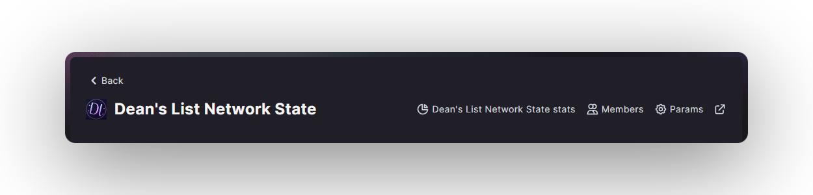
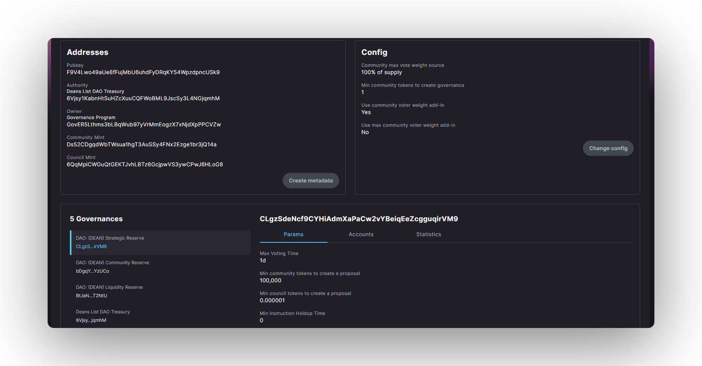
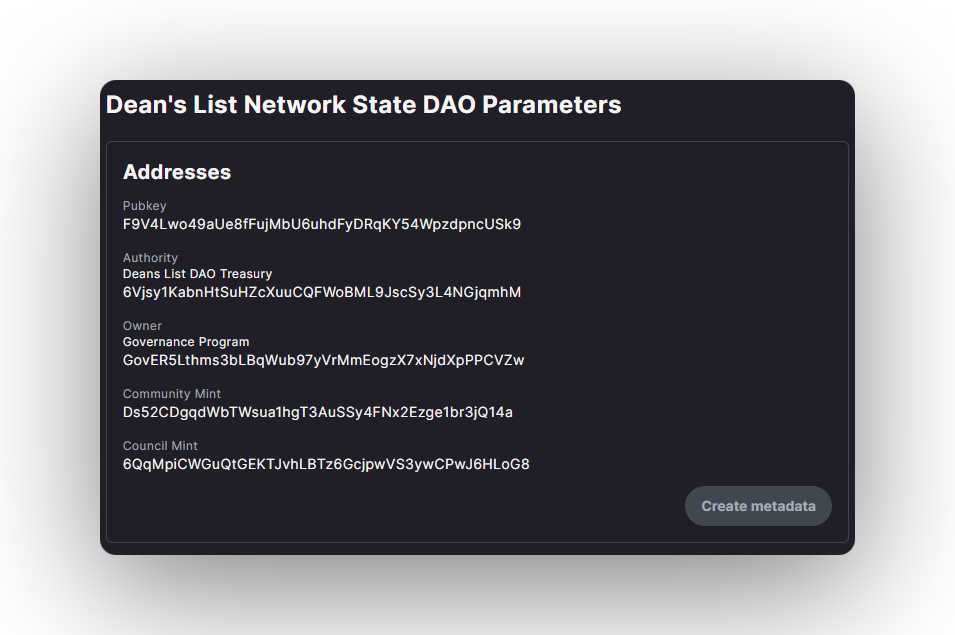
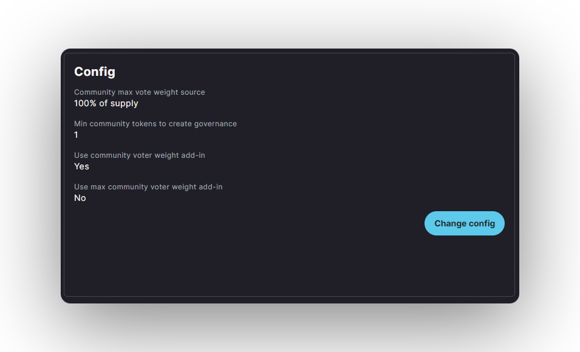
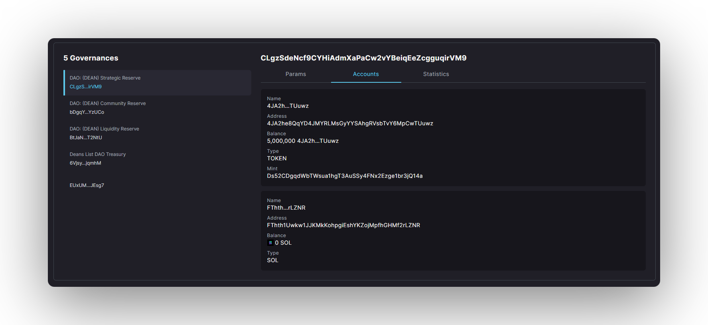

import { Callout } from 'nextra/components'

# DAO configuration

After a DAO is created, users that detain governance tokens or council tokens can change the DAO configuration.

<Callout type="error" emoji="🚨">
For safe measures against DAO attacks make sure you DAO configuration has a **high minimum of governance tokens** for it to be altered.
</Callout>

## Initial Config Visualisation

<Callout type="info" emoji="ℹ️">
**Dean's List Network State DAO** is used below for example purposes.
</Callout>

After a DAO is deployed the configuration of a DAO can be found in **`Params`**. 

### Parameters

Upon opening **`Params`** you will find the DAO main addresses, configuration & governances (treasuries).

### Addresses

In the addresses section users are able to see:

* **Pubkey**: Address of the DAO 
* **Authority 'x DAO Treasury'**: Dabra authority, usually set to one of the DAO wallets, the authority controls DAO configuration.
* **Owner 'Governance Program'**: spl-governance instance used by the DAO.
* **Community Mint**: Address of the chosen governance token.
* **Council Mint**: Address of the council token.

### Config

In the config section users are able to see:
* **Community max vote weight source**: Percentage of the token supply considered for quorum or absolute number of the token supply or set number by the DAO.
* **Min community tokens to create governance**: It is what it says.
<Callout type="info" emoji="ℹ️">
For **Multisig DAOs** without the community governance token, this value is irrelevant and it's defaulted to an arbitrary number of **1,000,000**.
</Callout>
* **Use community voter weight add-in**: Indicates whether voter weight governance plugin is used by the DAO.
* **Use max community voter weight add-in**: Indicates whether max voter weight governance plugin is used by the DAO.

### Governance (Treasuries)

In the governances section users are able to see the DAO treasury/ treasuries and their parameters, accounts & statistics.

For every treasury created an authority is also given for each.

## Config Modification

<Callout type="warning" emoji="⚠️">
This page's documentation is currently in progress.
</Callout>