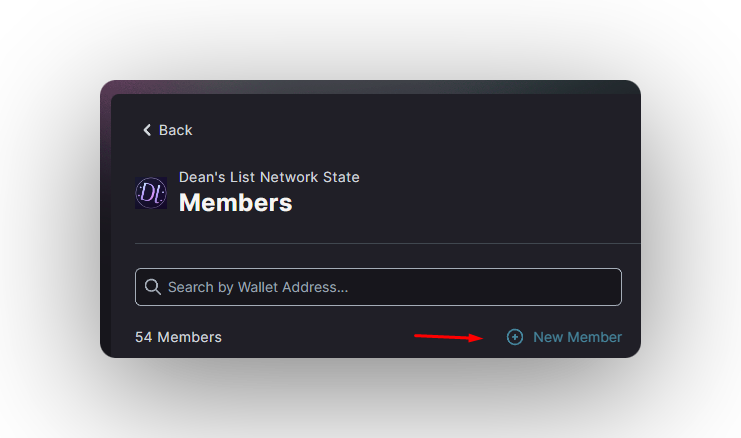

import { Callout } from 'nextra/components'
import { Steps } from 'nextra/components'

# Council in DAOs

## Understanding DAO Councils

Before diving into the technical aspects of adding or removing council members, it's important to understand the role and significance of councils in DAOs (Decentralized Autonomous Organizations).

## What is a DAO Council?

A DAO council is a group of elected or appointed members who have special privileges and responsibilities within the organization. They often play a crucial role in governance, decision-making, and day-to-day operations of the DAO.

## Importance of Council in DAOs

* **Efficient Decision Making:** Councils can make quicker decisions on routine matters, operations or more sensitive matters which can improve the DAO's operational efficiency.

* **Specialized Expertise:** Council members are often chosen for their expertise in specific areas, bringing valuable knowledge to the DAO.

* **Representation:** Councils can represent different stakeholder groups within the DAO, ensuring diverse perspectives are considered.

## Adding Council Members

<Steps>
### Step 1 - Accessing Members Panel

- Navigate to the Members section of your DAO's interface.
- Ensure you have the necessary permissions to propose new members.

### Step 2 - Initiating New Member Addition

- Click the [+] button in the members panel to start the process of adding a new member.

### Step 3 - Proposing a New Member

- Enter the new member's **wallet address** in the provided form.
- Click the **[Add Proposal]** button to create a proposal for adding the new member.

<Callout type="info" emoji="ℹ️">
The proposal form auto-fills with default values. You can override these if needed, but it's not required.
</Callout>

**Understanding Proposal Details**
    - **Proposal Title**: A concise, descriptive title for the proposal. This is what other DAO members will see when voting.
    - **Proposal Description**: A detailed explanation of why this member should be added to the council. Include their qualifications, expected contributions, and any other relevant information.
    - **Voter Weight**: This determines the new member's voting power within the DAO. A weight of 1 equals one vote. Consider carefully as this affects the balance of power in the DAO.

### Step 4 - The Voting Process

- After submitting your proposal and casting your vote, other DAO members must vote on the proposal.
- The required approval percentage depends on your DAO's specific governance rules.

### Step 5 - Executing the Proposal

- When enough members approve the proposal and the **approval quorum** is reached, it is automatically passed without waiting the full voting time (**3 days by default**).
- Finally, after the proposal is approved by the **DAO** members, in the "**Instructions**" section of the proposal click on the **\[Execute]** button to mint the membership token(s) to the new member.

</Steps>

## Removing Council Members

<Callout type="warning" emoji="⚠️">
This page's documentation is currently in progress.
</Callout>
