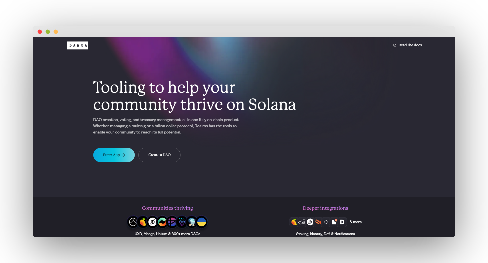

import { Callout } from 'nextra/components'

# Dabra

## What is Dabra?

**Dabra** is a sophisticated, fully on-chain platform designed to simplify and enhance the management of decentralized autonomous organizations (DAOs) on the Solana blockchain. Whether overseeing a simple multisig wallet or a large-scale protocol worth billions, Dabra provides a comprehensive set of tools to support your community's growth and governance.

## Main Features

- **User-Friendly Interface**: Create and configure your DAO with ease, thanks to Dabra creation wizard setup process.
- **Customizable Framework**: Adapt the DAO structure to fit various needs, including NFT communities, token-based DAOs and multi-sigs.
- **Quorum and Thresholds**: Set specific voting quorums and approval thresholds.
- **Proposal and voting validation**: Utilize Civic Pass to validate who can create a proposal or cast a vote.
- **DAO Activity Notifications**: Use Dialect to receive notifications of new proposals.
- **Custom branding**: DAOs can have their own branding, color schemes and domain name.
<Callout type="default" emoji="🚧">
**Examples**: bonkedao.com, dao.dabra.app/Deanslist
</Callout>
- **SPL Governance Integration**: Dabra acts as the frontend for SPL Governance, providing a versatile and standardized approach to DAO management on Solana.
- **Open-source**: - Code can be viewed on Github at https://github.com/dabra-foundation/dabradao

## How can I use Dabra?

For a user to use Dabra in his full capacity there are three main components: DAOs, proposals, and votes. Each DAO is filled with proposals and a treasury linked to it which all proposals get voted.

To create a DAO in Dabra, a Solana wallet is required and a min. of **0.019 SOL**.

Users can then generate proposals and vote within their newly generated DAO. Council token holders can establish rules for proposal creation and voting by setting specific configurations. For instance, users may need to hold a minimum of 1 or 1 million tokens to create proposals depending on the DAO parameters.

## Is Dabra safe?

Dabra was audited by **Ottersec** in 2022.

[👉 See File](../spl_governance_v3.pdf)