import { Callout, Steps } from "nextra/components";

# Limit Orders

## Limit Orders

With limit orders, you can buy/sell tokens directly from your DAO treasury.

**Fee:** 1 bps

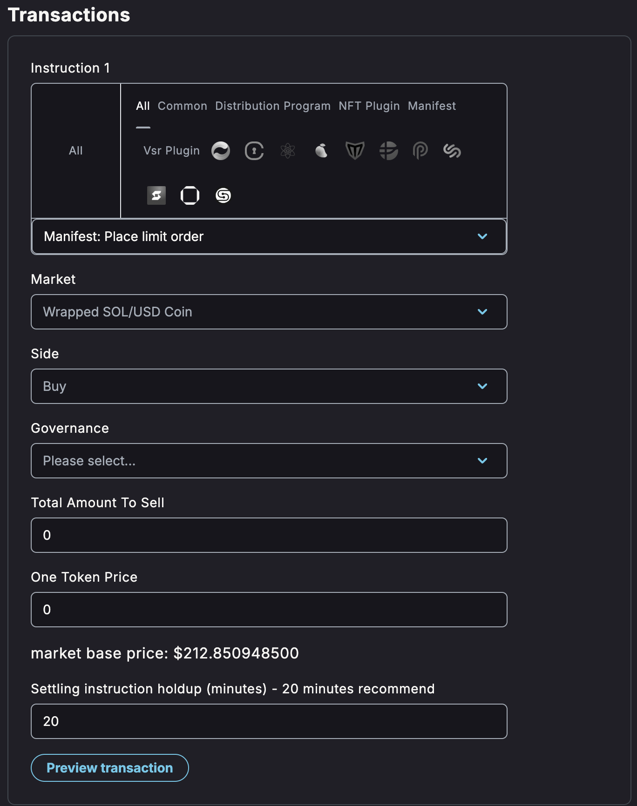

## Steps to Place a Limit Order

<Steps>

### Step 1 - Select Manifest: Place a limit order and choose the market corresponding to the coin you want to sell or buy

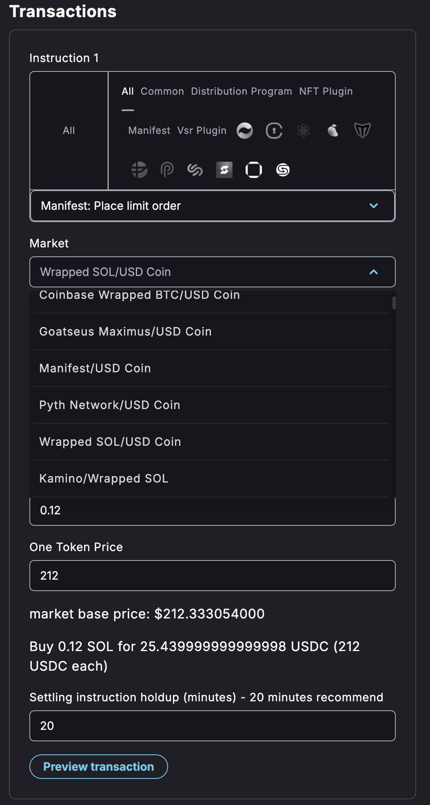

### Step 2 - Choose a side

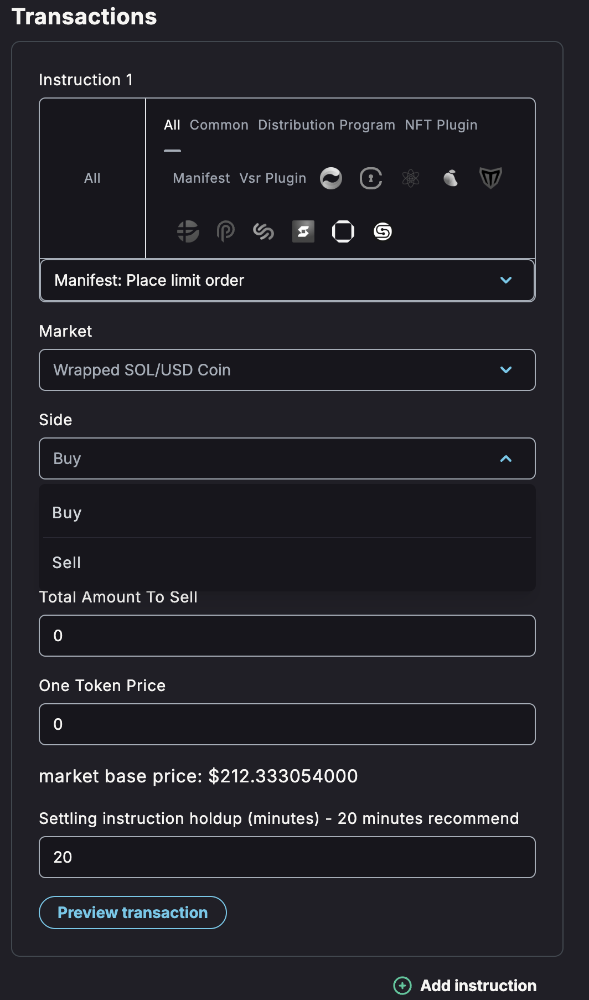

### Step 3 - Choose the token vault corresponding to the market you selected

For example, if you want to buy BONK, choose the token you want to pay with, e.g., USDC. If you want to sell BONK, choose BONK.

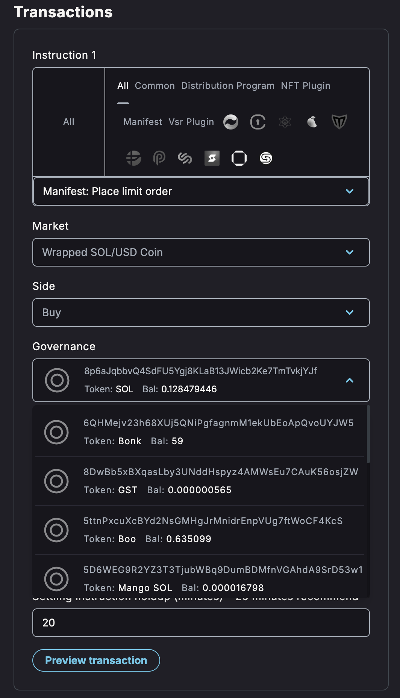

### Step 4 - Enter token amount and price

1. Enter the total amount of tokens you want to sell.
2. Enter the price per token.
3. Check if the summary matches what you want to propose.

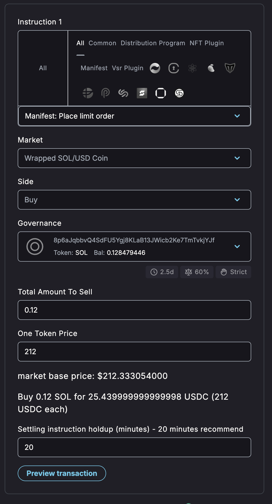

### Step 5 - Set holdup time

This setting prevents the settlement instruction from executing before the order is filled.

**Recommended:** 15-20 minutes. The setting should depend on the price and liquidity of the selected market.

### Step 6 - Submit proposal

After proposing and voting on your limit order, click the **Execute** button. This places the limit order, and the settlement instruction will be blocked from execution for the duration you set in the previous step.

For example, if you set a 5-minute delay, after waiting 5 minutes, you can settle. If the order was filled within that time, the tokens will be transferred to the treasury.

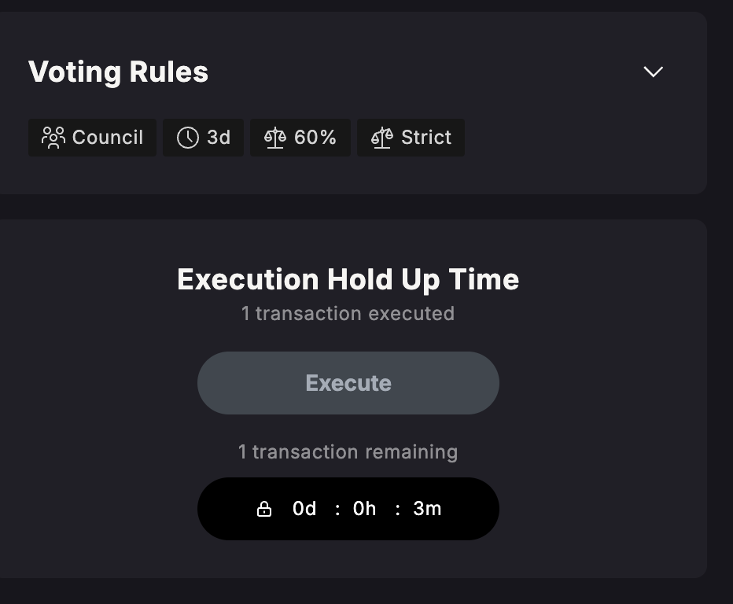
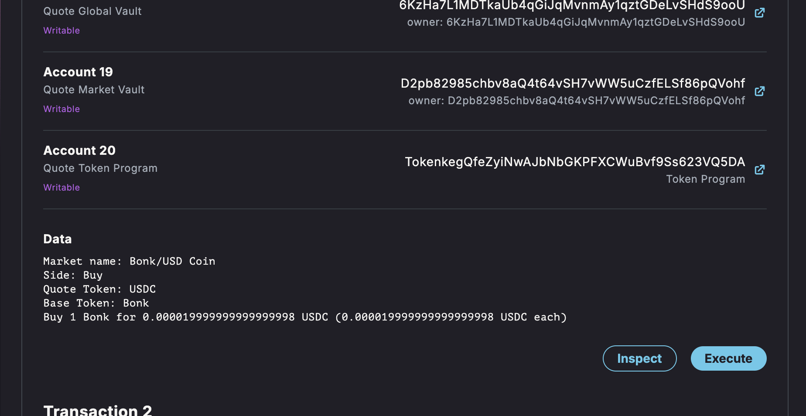
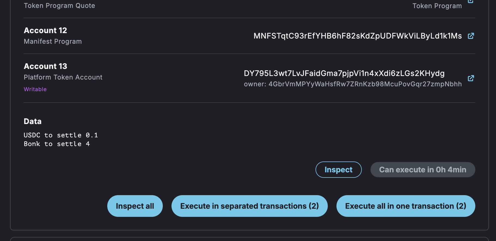

</Steps>

## Canceling an Order

<Steps>

### Step 1 - Select Manifest: Cancel limit order

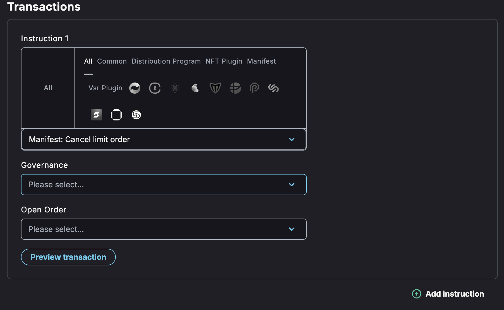

### Step 2 - Select the Solana wallet that holds the tokens you wanted to sell/buy

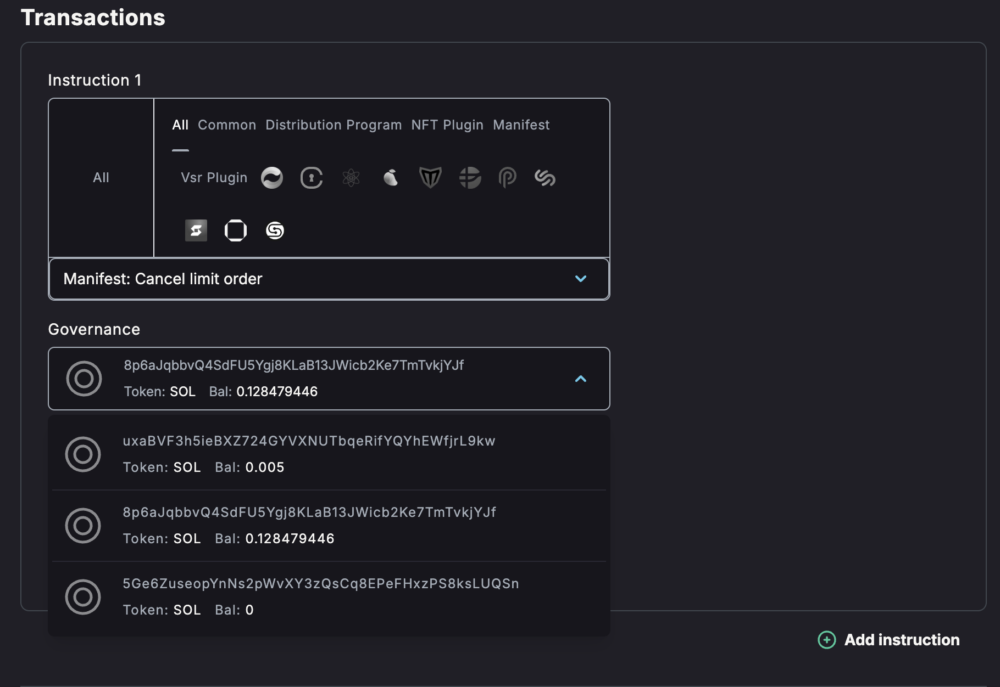

### Step 3 - Select the order you want to cancel and click **Propose**

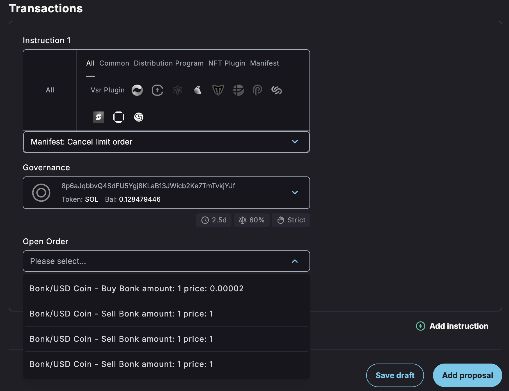

</Steps>
