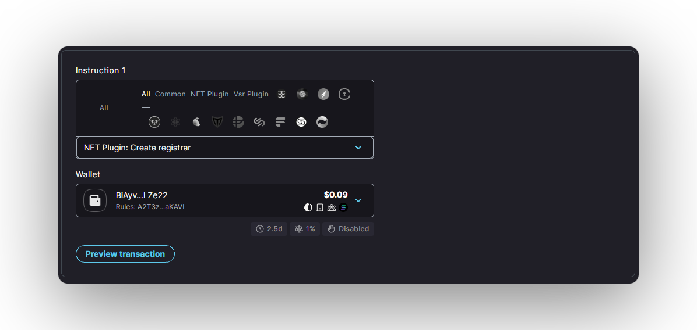
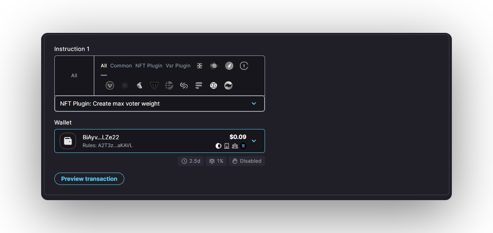
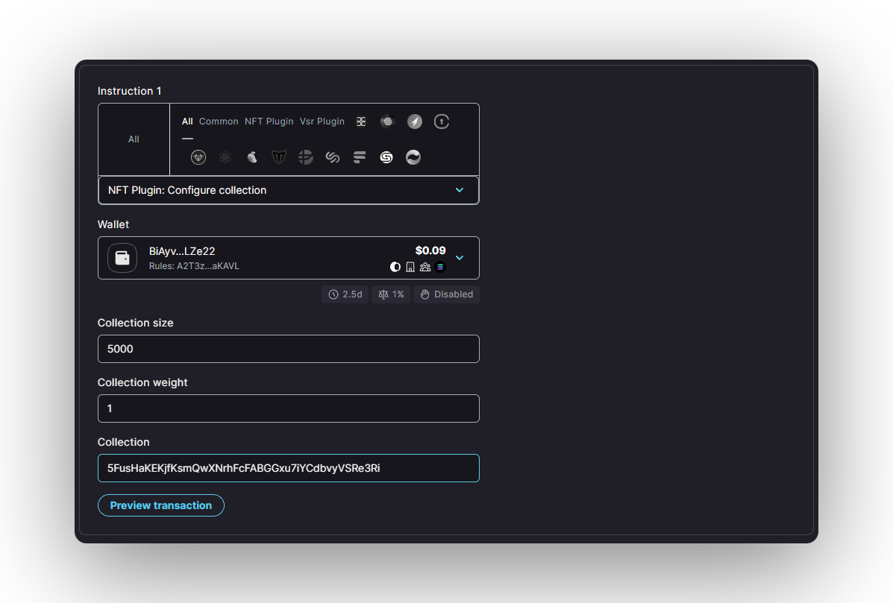
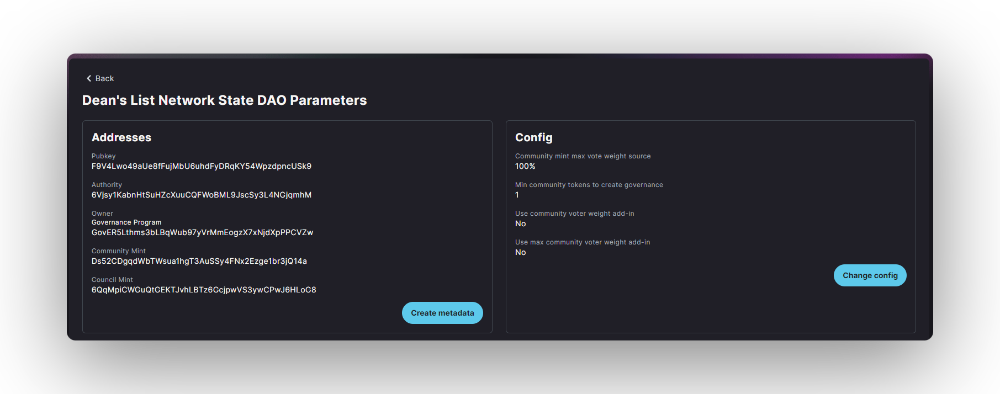
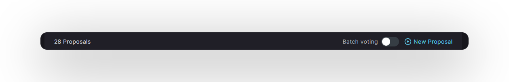
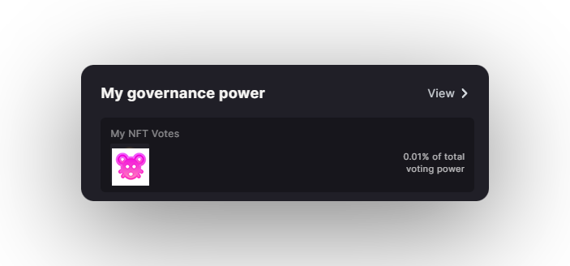

import { Callout } from 'nextra/components'
import { Steps } from 'nextra/components'

## Configure NFT Voting Plugin and Enable NFT Voting Plugin

<Callout type="default" emoji="🔮">
This page is a continuation and copy of the original [NFT Community DAO Setup](/setup/daonft.mdx)
</Callout>

**NFT Community DAO** is a **DAO** where NFTs are used as the governance token. Any DAO can enable NFT voting through the `Plug & Play` mechanism of [**`spl-governance`**](https://github.com/dabra-foundation/solana-program-library/blob/master/governance/README.md).

In order to enable NFT governance for a DAO the [**`NFT voting plugin`**](https://github.com/dabra-foundation/governance-program-library) has to be enabled for the **DAO**.

The NFT voting plugin grants governance power to NFTs based on the [**Metaplex Certified Collection**](https://www.metaplex.com/posts/certified-collections) they belong to.&#x20;

<Callout type="info" emoji="ℹ️">
**Metaplex** supports certified collections from **version 1.1** of the standard.

NFTs minted with the older Metadata standard must be upgraded first to the **latest version** before they can be used for governance.
</Callout>

In the most basic scenario each NFT gives its owner **1 vote**. The owner can have multiple NFTs and vote with all of them at once.

A **DAO** can also use more advanced scenarios where multiple collections with different voting power are used. This way a multi tier governance structure can be created where different NFTs can represent different membership levels.

Only NFTs with **certified collection** on their metadata can participate in governance.

<Callout type="error" emoji="🚨">
Beware the **authority** of the collection can certify and uncertify NFTs for the collection.

It means it has the **ultimate power** to decide who can and can't vote in the **DAO**. It's recommended for the **authority** to be transferred to the **DAO**.
</Callout>

<Steps>
### Step 1 - Create DAO

If you already have your DAO created, you can skip this section. However, please take note of the DAO parameters needed for the setup and adjust your DAO configuration accordingly. To create the NFT Community DAO, use the Bespoke DAO Wizard with the following parameters:

* **`Min community tokens to create proposal`**: Set to 1 to allow each NFT holder to create new governances. If a more restrictive setup is required, the min threshold can be set to a higher value accordingly.
* **`Custom program Id`**: Use the default instance of **`spl-governance`** or an instance with a minimum **version of v2.2.4**.

<Callout type="error" emoji="🚨">
spl-governance program version must be equal or higher than **v2.2.4** for the NFT plugin to work correctly.

If the plugin is enabled for **older versions** it can result in irreversible deadlock of the **DAO**.
</Callout>

* **`Council`**: Setup a DAO with the council.

<Callout type="info" emoji="ℹ️">
It's recommended to always set up the council as a Multisig for the initial DAO members. The members would be able to moderate the DAO governance process at its inception and prevent irreversible actions like setting impossible quorums or defending the DAO from governance attacks. After successful decentralization, the council can be removed through a proposal​.
</Callout>

### Step 2 - Configure NFT Voting Plugin

To configure the NFT Plugin, a proposal with the following 3 instructions must be created:

* Create NFT plugin registrar.

* Create NFT plugin max voter weight.

* Configure NFT plugin collection.

The NFT collection configuration instruction must be added for every NFT collection which should be allowed to participate in governance of the **DAO**. Each NFT collection has the following parameters:

* **`Collection size`**: The number of certified NFTs in the collection. The size of the collection is used to calculate the maximum voter weight and voting quorum levels.
* **`Collection weight`**: The relative voting weight of the NFTs from the collection.
* **`Collection`**: The Id of the NFT collection which should be used for governance​.

<Callout type="default" emoji="🆔">
The **collection ID** can be found on the NFT explorer view. For example for [Dean's List](https://explorer.solana.com/address/B5DeZ7s9FLmSMMftwFNtbSWKACW7EjHDh4caYV3oFKks) NFT the collection id is **`5FusHaKEKjfKsmQwXNrhFcFABGGxu7iYCdbvyVSRe3Ri`**
</Callout>

### Step 3 - Enable NFT Voting Plugin

Once the NFT voting plugin configuration proposal is voted on and all instructions executed, the DAO can enable NFT governance through a **`DAO Config Change`** proposal.

From the **DAO** parameters page, select **`Change Config`** option or create a **`Proposal`** directly.

And then set the **DAO** configuration parameters.

Both **`Community voter weight addin`** and **`Community max voter weight addin`** parameters should be set to the NFT Voting Plugin Program Id:

**`GnftV5kLjd67tvHpNGyodwWveEKivz3ZWvvE3Z4xi2iw`**

### Step 4 - Voting with NFTs

Once the proposal to enable the NFT Voting Plugin for the **DAO** is executed, any owner of an NFT from the configured collection can participate in the **DAO** governance.

The NFTs eligible for governance are displayed in the account view.

</Steps>

<Callout type="default" emoji="👉">
In need of **help**? Hop on on [**Dabra Discord**](https://discord.com/invite/VsPbrK2hJk) and ask away your questions!
</Callout>