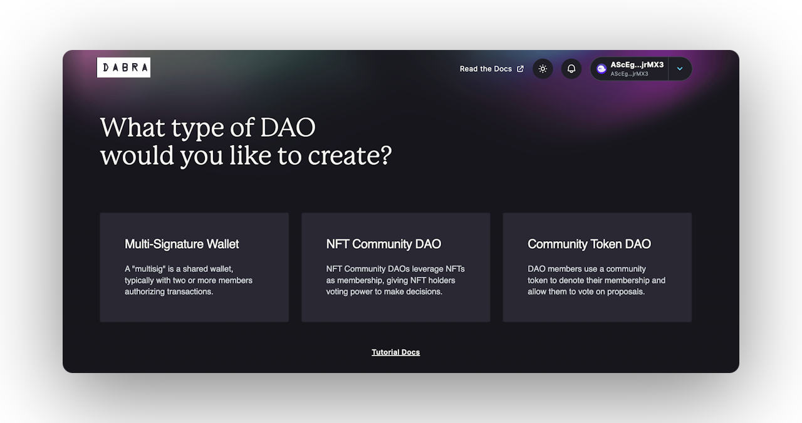
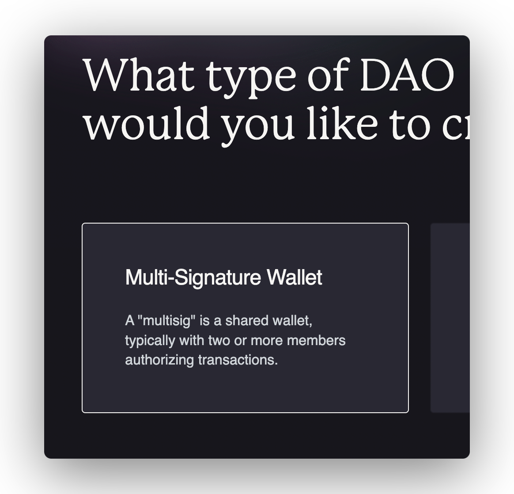

import { Callout } from 'nextra/components'
import { Steps } from 'nextra/components'

# Multi-Signature DAO

## DAO Creation

The **multisig** option is the first and easiest way to create a **DAO**. When you select this option you only need to worry about three things:

1. The name of your **DAO.**
2. The **approval quorum**, that is the minimum amount of yes votes to accept a proposal.
3. People who'll be part of your team, whose will own a **council token**.

<Callout type="warning" emoji="⚠️">
Make sure to review all info and **double check** if everything is correct.

After creating the DAO make sure to create a **test proposal** to see if the DAO is running on the correct parameters and to see if proposals can go through the quorum.

</Callout>

<Steps>
### Step 1 - Selection

Go to the [Dabra](https://app.dabra.app/daos) home page and click on **`Create DAO`**. A wizard will appear to guide you through the process​.

### Step 2 - Name

Enter the name of your **DAO** in the provided field​.

<Callout type="info" emoji="ℹ️">
Dabra will provide a **governance program ID** by **default**, users can add their own customer Program ID under **`Advanced Options`** at this step in the multisig wallet wizard.
</Callout>

### Step 3 - Invite Members

Input Solana addresses to add members to the multisig wallet​.

### Step 4 - Approval Quorum

Select the minimum percentage of **`yes votes`** required to approve a proposal. The default is **60%**.

### Step 5 - Review

After following these steps, your setup should look similar to the image below. When ready, click **`Create wallet`**. Your wallet will pop up asking for a signature. Approve to create the tokens and deploy the **DAO**​.

</Steps>

<Callout type="warning" emoji="⚠️">
Make sure to review all info and **double check** if everything is correct.
</Callout>

<Callout type="info" emoji="ℹ️">
After the transaction is complete, you'll be redirected to the **DAO**'s page.
</Callout>
