import { Callout } from 'nextra/components'
import { Steps } from 'nextra/components'

# Create a NFT Community DAO

## DAO Creation

**NFT Community DAO** is a **DAO** where NFTs are used as the governance token. Any DAO can enable NFT voting through the `Plug & Play` mechanism of [**`spl-governance`**](https://github.com/dabra-foundation/solana-program-library/blob/master/governance/README.md).

In order to enable NFT governance for a DAO the [**`NFT voting plugin`**](https://github.com/dabra-foundation/governance-program-library) has to be enabled for the **DAO**.

The NFT voting plugin grants governance power to NFTs based on the [**Metaplex Certified Collection**](https://www.metaplex.com/posts/certified-collections) they belong to.

<Callout type="info" emoji="ℹ️">
**Metaplex** supports certified collections from **version 1.1** of the standard.

NFTs minted with the older Metadata standard must be upgraded first to the **latest version** before they can be used for governance.
</Callout>

In the most basic scenario each NFT gives its owner **1 vote**. The owner can have multiple NFTs and vote with all of them at once.

A **DAO** can also use more advanced scenarios where multiple collections with different voting power are used. This way a multi tier governance structure can be created where different NFTs can represent different membership levels.

Only NFTs with **certified collection** on their metadata can participate in governance.

<Callout type="error" emoji="🚨">
Beware the **authority** of the collection can certify and uncertify NFTs for the collection.

It means it has the **ultimate power** to decide who can and can't vote in the **DAO**. It's recommended for the **authority** to be transferred to the **DAO**.
</Callout>

<Callout type="warning" emoji="⚠️">
Make sure to review all info and **double check** if everything is correct.

After creating the DAO make sure to create a **test proposal** to see if the DAO is running on the correct parameters and to see if proposals can go through the quorum.

</Callout>

<Steps>
### Step 1 - Selection

Go to [**Dabra**](https://app.dabra.app/daos) and connect your wallet in the top right corner by clicking on **`Sign in with Solana`**.

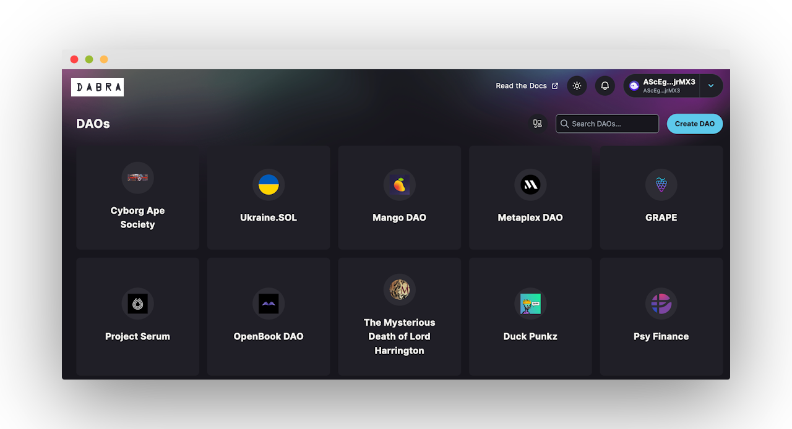

Click on **`Create DAO`** button and the following wizard will be shown, in our case we will select **NFT Community DAO**:

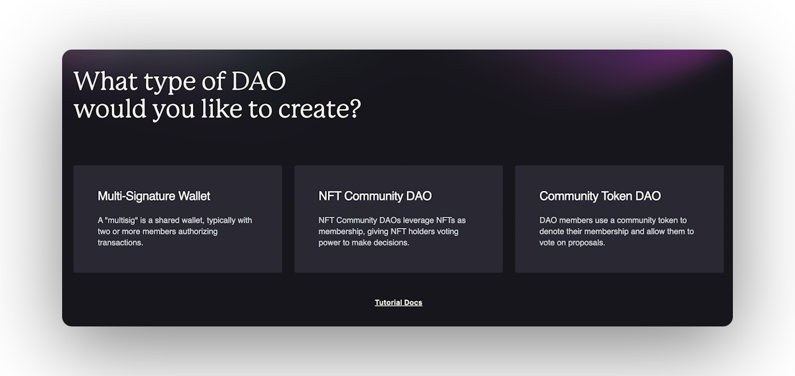

### Step 2 - Name

Your **DAO** needs a name, so now is the time to choose one. We will use [**SMB Collection**](https://www.tensor.trade/trade/solana_monkey_business) as an example in this walkthrough.

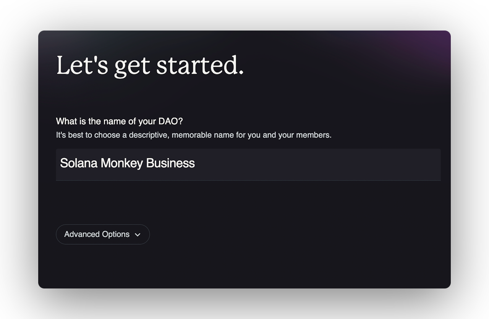

<Callout type="info" emoji="ℹ️">
Dabra will provide a governance program ID by **default**, users can add their own customer Program ID under **`Advanced Options`** at this step in the community token **DAO** wizard.
</Callout>

### Step 3 - NFT Collection

In this step, you will need to add the address of the **NFT Collection** you wish to use for voting.

<Callout type="default" emoji="🆔">
The **collection ID** can be found on the NFT explorer view. For example for [Dean's List](https://explorer.solana.com/address/B5DeZ7s9FLmSMMftwFNtbSWKACW7EjHDh4caYV3oFKks) NFT the collection id is **`5FusHaKEKjfKsmQwXNrhFcFABGGxu7iYCdbvyVSRe3Ri`**
</Callout>

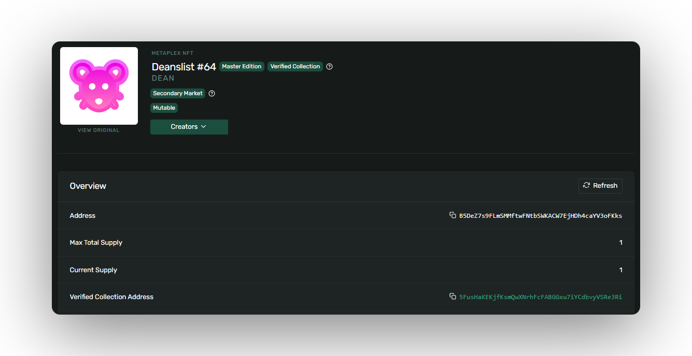

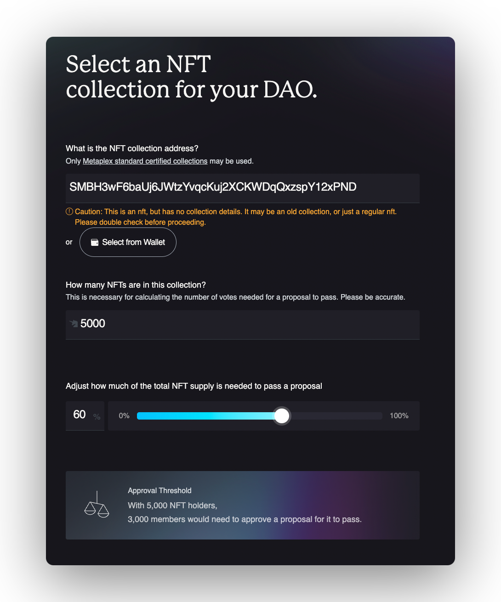

<Callout type="error" emoji="🚨">
It is important to ensure that the collection is [**certified by the Metaplex standard**](https://docs.metaplex.com/programs/token-metadata/certified-collections) since it only possible to procced to the next step if the collection is **certified**.

This certification ensures that the collection has been verified as authentic and meets the required standards for governance.
</Callout>

Once you have added the collection address, you will also need to input the number of NFTs in the collection. It's **important** to be as accurate as possible with this number, as it is used to calculate the number of votes needed for a proposal to pass.

### Step 4 - Approval Treshold

Finally, you will need to adjust the percentage of the total NFT supply that is required for a proposal to pass. By default, the threshold is set to **60%**, but you can adjust this based on the needs of your DAO.

For example, if the approval threshold is set at **60%**, this means that a proposal needs to receive **60%** or more "**yes**" votes to be approved. If the proposal receives less than **60%** "**yes**" votes, it will not be **approved**.

**DAOs** can set their own approval thresholds, and they can vary depending on the context and the specific rules of the **DAO**. In some **DAOs**, the approval threshold may be set very high to ensure that decisions are only made with a broad consensus, while in other **DAOs**, the approval threshold may be set lower to allow for more flexibility in decision making.

### Step 5 - DAO Council

In this step you will be able to **create** or **use an existing token** for the DAO's council.

If your DAO's Council have an existing token select "**Yes**" and provide the address of the token you would like to use. If your DAO's Council doesn't have an existing token select "**No**" and skip to the next step.

<Callout type="info" emoji="ℹ️">
**Dabra** will automatically say if the token address is **correct** or **not**.
</Callout>

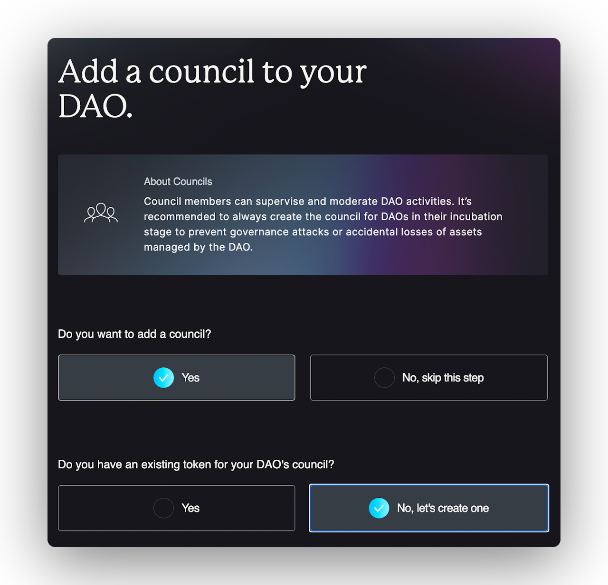

Whether to create a new token for the **DAO** council or use an existing token depends on the specific **goals**, **structure**, and **context of your DAO**. Here are some factors to consider:

* **Purpose and utility:** If the existing token already serves the **DAO's** purpose and aligns with its goals, using it for the council can streamline governance. However, if a new token can provide additional utility or better align with the **DAO's** objectives, creating a new one may be beneficial.
* **Token distribution:** If the existing token's distribution is fair and representative of the community, it may be suitable for the **DAO** council. Otherwise, a new token might be necessary to ensure broader and more balanced representation.
* **Community engagement:** Using an existing token can leverage the existing community and its interest, while a new token might attract a fresh audience and foster new engagement.
* **Economic factors:** Consider the potential impact on token value, inflation, and overall token economics when deciding between using an existing token or creating a new one.

### Step 6 - Council Members Invitiation

In this step you will be able to invite council members to the **DAO** by using their Solana wallet address.

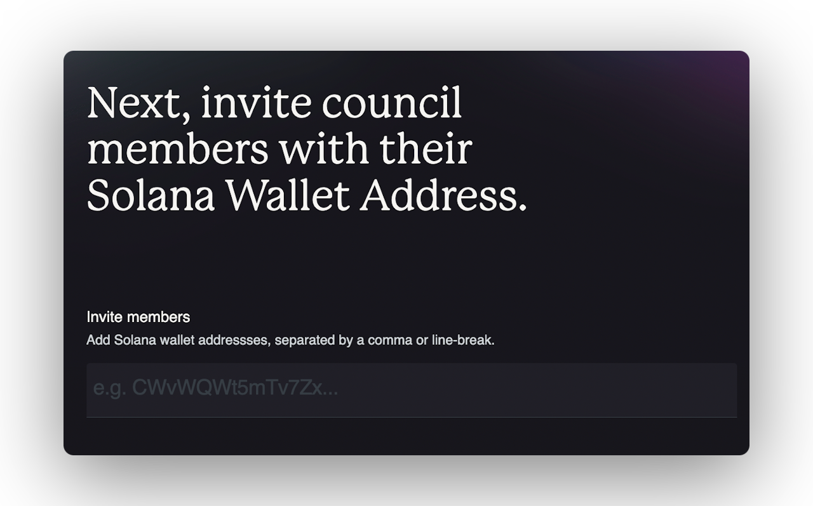

<Callout type="info" emoji="ℹ️">
Council members can supervise and moderate **DAO** activities.

It's recommended to always create the council for **DAOs** in their incubation stage to prevent **governance attacks** or **accidental losses** of assets managed by the **DAO**.
</Callout>

### Step 7 - DAO Council Approval Threshold

Almost there! Here you will be setting up your council approval treshold.

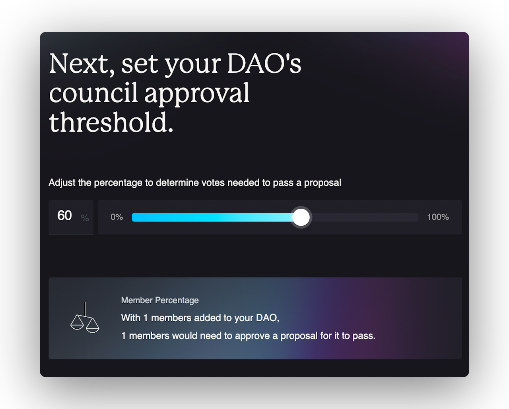

<Callout type="warning" emoji="⚠️">
Starting with a lower approval threshold can provide easier **decision-making** and **flexibility**, but may also risk power concentration and susceptibility to attacks.

The ideal threshold depends on the **DAO's** goals, community needs, and balance between efficiency, decentralisation, and security.

The specific threshold will depend on the goals and characteristics of the **DAO** and its community. It can also be adjusted over time based on feedback.
</Callout>

### Step 8 - Review

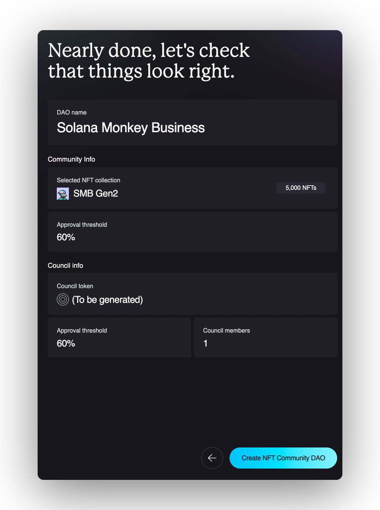

<Callout type="warning" emoji="⚠️">
Make sure to review all info and **double check** if everything is correct.
</Callout>

<Callout type="info" emoji="ℹ️">
After the transaction is complete, you'll be redirected to the **DAO**'s page.
</Callout>

## Configure NFT Voting Plugin and Enable NFT Voting Plugin

**NFT Community DAO** is a **DAO** where NFTs are used as the governance token. Any DAO can enable NFT voting through the `Plug & Play` mechanism of [**`spl-governance`**](https://github.com/dabra-foundation/solana-program-library/blob/master/governance/README.md).

In order to enable NFT governance for a DAO the [**`NFT voting plugin`**](https://github.com/dabra-foundation/governance-program-library) has to be enabled for the **DAO**.

The NFT voting plugin grants governance power to NFTs based on the [**Metaplex Certified Collection**](https://www.metaplex.com/posts/certified-collections) they belong to.&#x20;

<Callout type="info" emoji="ℹ️">
**Metaplex** supports certified collections from **version 1.1** of the standard.

NFTs minted with the older Metadata standard must be upgraded first to the **latest version** before they can be used for governance.
</Callout>

In the most basic scenario each NFT gives its owner **1 vote**. The owner can have multiple NFTs and vote with all of them at once.

A **DAO** can also use more advanced scenarios where multiple collections with different voting power are used. This way a multi tier governance structure can be created where different NFTs can represent different membership levels.

Only NFTs with **certified collection** on their metadata can participate in governance.

<Callout type="error" emoji="🚨">
Beware the **authority** of the collection can certify and uncertify NFTs for the collection.

It means it has the **ultimate power** to decide who can and can't vote in the **DAO**. It's recommended for the **authority** to be transferred to the **DAO**.
</Callout>

### Step 9 - Create DAO

If you already have your DAO created, you can skip this section. However, please take note of the DAO parameters needed for the setup and adjust your DAO configuration accordingly. To create the NFT Community DAO, use the Bespoke DAO Wizard with the following parameters:

* **`Min community tokens to create proposal`**: Set to 1 to allow each NFT holder to create new governances. If a more restrictive setup is required, the min threshold can be set to a higher value accordingly.
* **`Custom program Id`**: Use the default instance of **`spl-governance`** or an instance with a minimum **version of v2.2.4**.

<Callout type="error" emoji="🚨">
spl-governance program version must be equal or higher than **v2.2.4** for the NFT plugin to work correctly.

If the plugin is enabled for **older versions** it can result in irreversible deadlock of the **DAO**.
</Callout>

* **`Council`**: Setup a DAO with the council.

<Callout type="info" emoji="ℹ️">
It's recommended to always set up the council as a Multisig for the initial DAO members. The members would be able to moderate the DAO governance process at its inception and prevent irreversible actions like setting impossible quorums or defending the DAO from governance attacks. After successful decentralization, the council can be removed through a proposal​.
</Callout>

### Step 10 - Configure NFT Voting Plugin

To configure the NFT Plugin, a proposal with the following 3 instructions must be created:

* Create NFT plugin registrar.

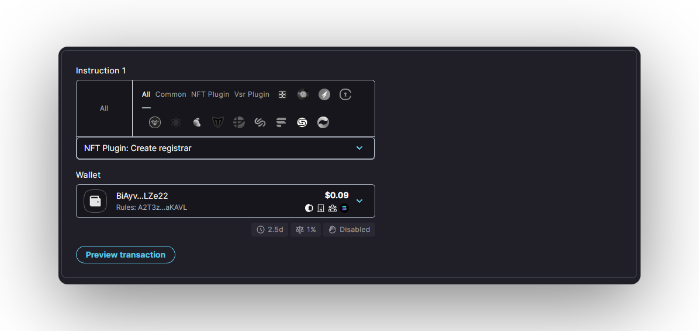

* Create NFT plugin max voter weight.

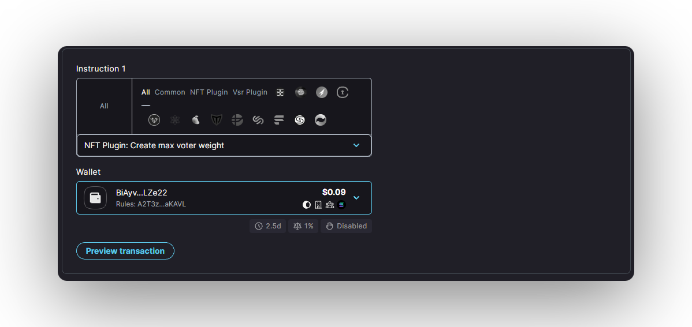

* Configure NFT plugin collection.

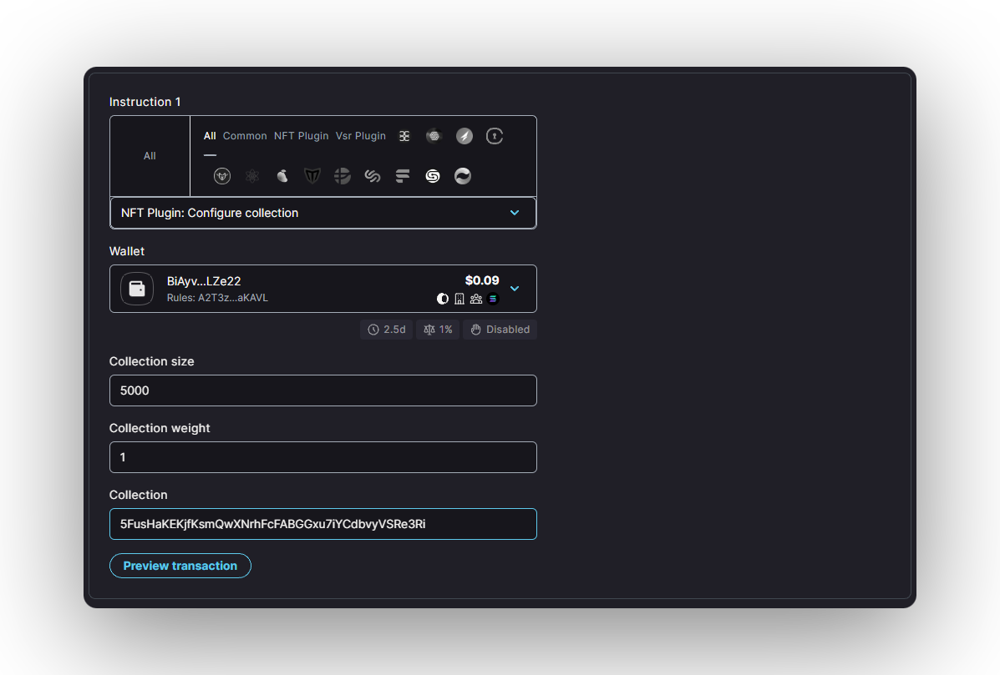

The NFT collection configuration instruction must be added for every NFT collection which should be allowed to participate in governance of the **DAO**. Each NFT collection has the following parameters:

* **`Collection size`**: The number of certified NFTs in the collection. The size of the collection is used to calculate the maximum voter weight and voting quorum levels.
* **`Collection weight`**: The relative voting weight of the NFTs from the collection.
* **`Collection`**: The Id of the NFT collection which should be used for governance​.

<Callout type="default" emoji="🆔">
The **collection ID** can be found on the NFT explorer view. For example for [Dean's List](https://explorer.solana.com/address/B5DeZ7s9FLmSMMftwFNtbSWKACW7EjHDh4caYV3oFKks) NFT the collection id is **`5FusHaKEKjfKsmQwXNrhFcFABGGxu7iYCdbvyVSRe3Ri`**
</Callout>

### Step 11 - Enable NFT Voting Plugin

Once the NFT voting plugin configuration proposal is voted on and all instructions executed, the DAO can enable NFT governance through a **`DAO Config Change`** proposal.

From the **DAO** parameters page, select **`Change Config`** option or create a **`Proposal`** directly.

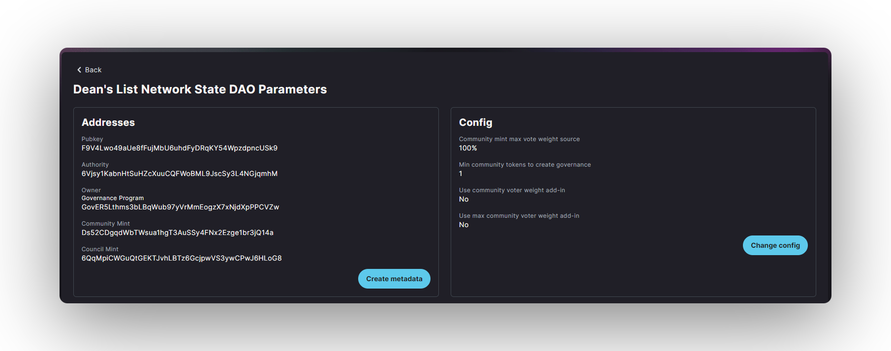

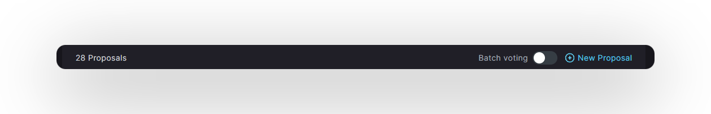

And then set the **DAO** configuration parameters.

Both **`Community voter weight addin`** and **`Community max voter weight addin`** parameters should be set to the NFT Voting Plugin Program Id:

**`GnftV5kLjd67tvHpNGyodwWveEKivz3ZWvvE3Z4xi2iw`**

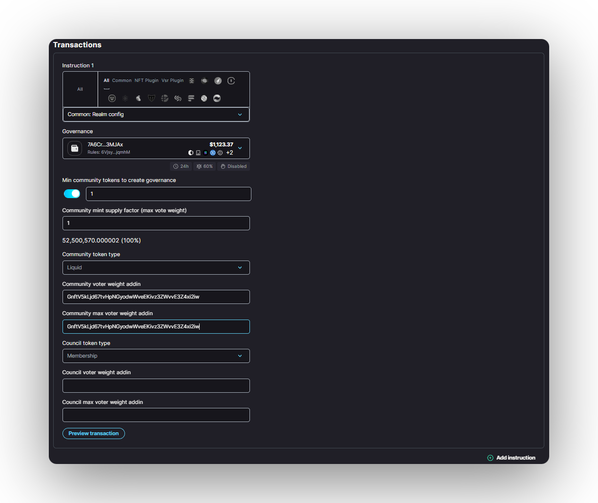

### Step 12 - Voting with NFTs

Once the proposal to enable the NFT Voting Plugin for the **DAO** is executed, any owner of an NFT from the configured collection can participate in the **DAO** governance.

The NFTs eligible for governance are displayed in the account view.

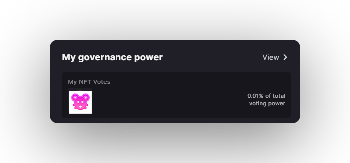
</Steps>
