import { Callout } from 'nextra/components'
import { Steps } from 'nextra/components'

# Community Token DAO

## DAO Creation
When you choose to create a Community Token **DAO**, we assume that you're an advanced user who understands all the governance setup details and we present you a more complex and flexible form than the multisig **DAO**.

<Callout type="info" emoji="▶️">
<iframe width="560" height="315" src="https://www.youtube.com/embed/eIjuq2IAnck?si=eJf3iX0ovQTo3h2-" title="YouTube video player" frameborder="0" allow="accelerometer; autoplay; clipboard-write; encrypted-media; gyroscope; picture-in-picture; web-share" allowFullScreen="allowFullScreen"></iframe>
</Callout>

<Callout type="warning" emoji="⚠️">
Make sure to review all info and **double check** if everything is correct.

After creating the DAO make sure to create a **test proposal** to see if the DAO is running on the correct parameters and to see if proposals can go through the quorum.

For any assistance in these test proposals feel free to join our **Discord**.
</Callout>

<Steps>
### Step 1 - Selection

Go to [**Dabra**](https://app.dabra.app/daos) and connect your wallet in the top right corner by clicking on **`Sign in with Solana`**.

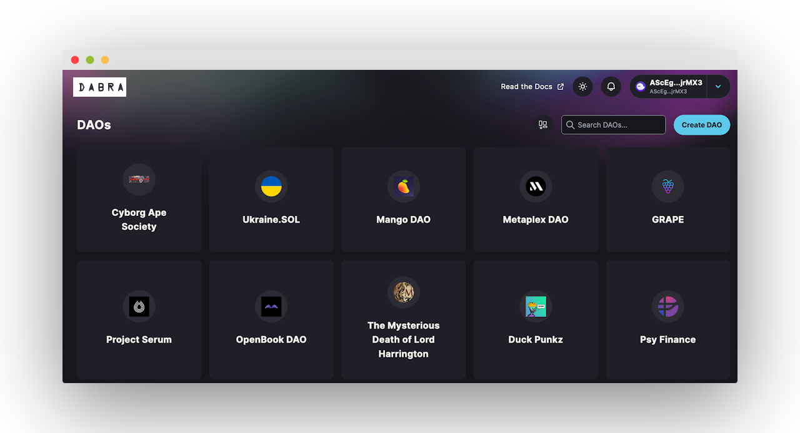

Click on **`Create DAO`** button and the following wizard will be shown, in our case we will select **NFT Community DAO.**

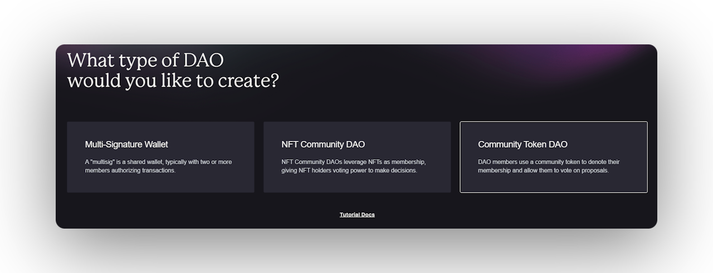

### Step 2 - Name

Your **DAO** needs a name, so now is the time to choose one.

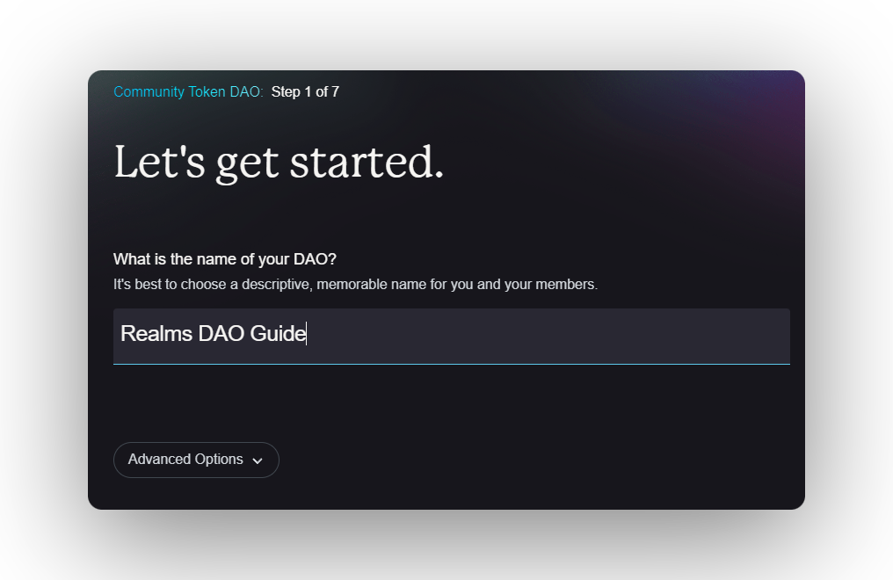

<Callout type="info" emoji="ℹ️">
Dabra will provide a governance program ID by **default**, users can add their own customer Program ID under **`Advanced Options`** at this step in the community token **DAO** wizard.
</Callout>

### Step 3 - Community Token

If the your **DAO's** community have an existing token select "**Yes**" and provide the address of the community token you would like to use.&#x20;

If the your **DAO's** community doesn't have an existing token select "**No**" and skip to step **4**.

<Callout type="info" emoji="ℹ️">
Dabra supports standart SPL token program and token extensions. (**SPL & Token22**)

Dabra will automatically say if the token address is **correct** or **not**.
</Callout>

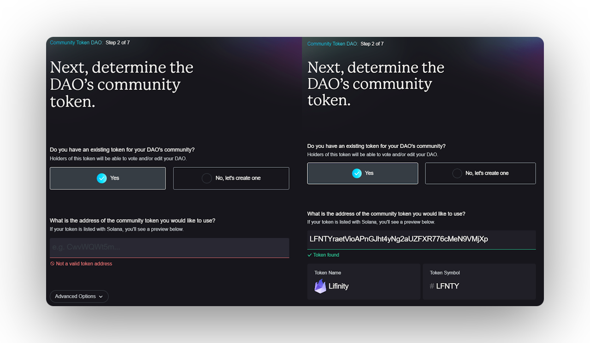

After completing the step above you will have the option to:

* Transfer mint **authority** of the token to the **DAO**.
* Set the minimum number of community tokens needed to manage this **DAO**.

<Callout type="warning" emoji="⚠️">
Do not transfer **mint authority** of the token to the **DAO** till the **DAO** is not secure enough and also to prevent **51% attacks**.

Regarding the minimum number of community tokens needed to manage the **DAO** it's also recommended to set a very high value since if it's a low value a entity or person can achieve they will be able to manage the **DAO** and cause malicious attacks or do malicious acts.
</Callout>

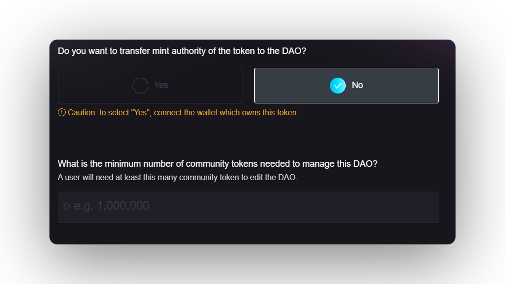

<Callout type="info" emoji="ℹ️">
Dabra will set the type of max voter weight to "**Supply Fraction**" and set the circulating supply factor by "**1**" by default for SPL tokens, users can select which type of max voter weight they wanna use and also define the circulating supply factor under **`Advanced Options`** at this step in the Community Token **DAO** wizard.
</Callout>

<Callout type="warning" emoji="⚠️">
For token extensions (**Token22**), Dabra will set the type of max voter weight to "**Absolute**" and set the circulating supply factor to the **number of tokens circulating** by default.
</Callout>
### Step 4 - Community Token

After selecting "**No**" you will be prompt to define the minimum number of community tokens needed to manage the DAO.

<Callout type="info" emoji="ℹ️">
Dabra suggests a minimum of **`1,000,000`** but there is no universally recommended minimum number of community tokens needed to manage a **DAO**.&#x20;

The optimal number of tokens and their distribution depend on the specific goals, structure, and size of the community involved.
</Callout>

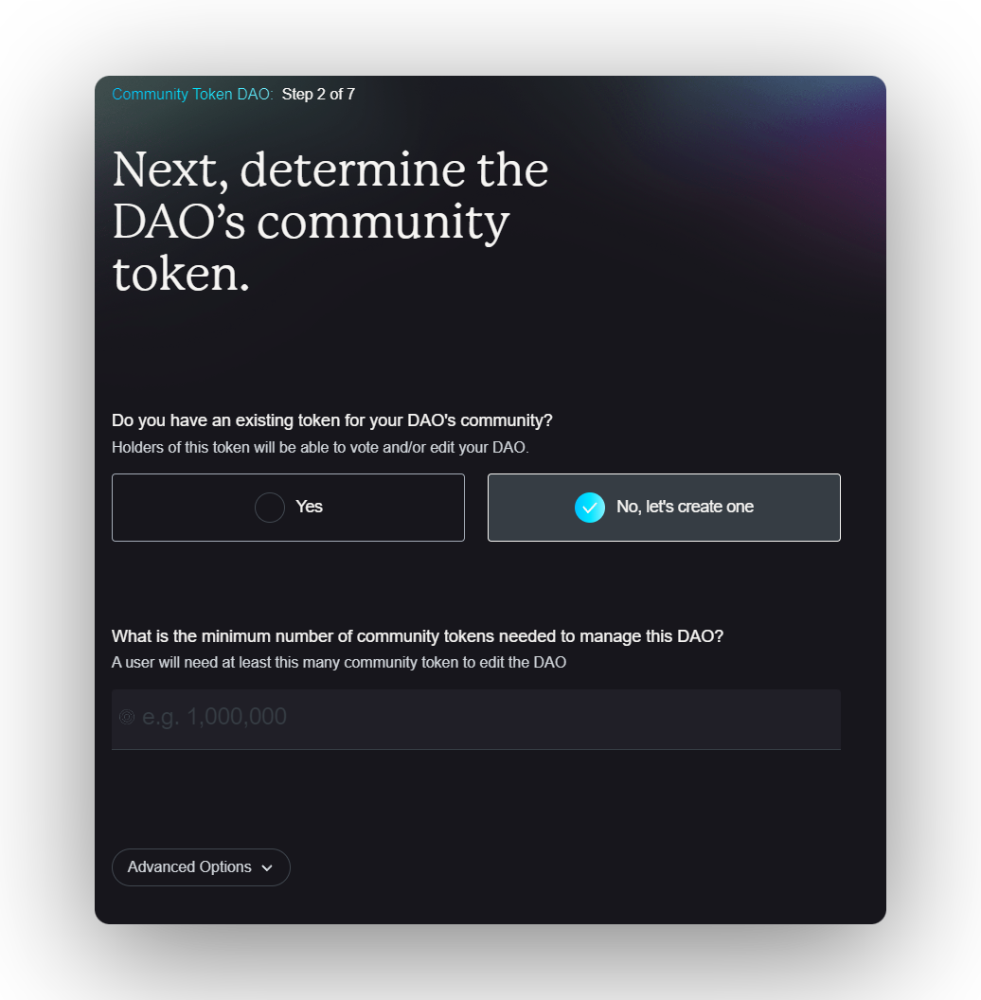

<Callout type="info" emoji="ℹ️">
Dabra will set the type of max voter weight to "**Supply Fraction**" and set the circulating supply factor by "**1**" by default, users can select which type of max voter weight they wanna use and also define the circulating supply factor under **`Advanced Options`** at this step in the Community Token **DAO** wizard.
</Callout>

### Step 5 - Approval Treshold

In the next step, you are going to set **the approval threshold**. The approval threshold refers to the minimum percentage of votes required for a proposal or decision to be approved. **The default is 60%.**

For example, if the approval threshold is set at **60%**, this means that a proposal needs to receive **60%** or more "**yes**" votes to be approved. If the proposal receives less than **60%** "**yes**" votes, it will not be approved.

**DAOs** can set their own approval thresholds, and they can vary depending on the context and the specific rules of the **DAO**. In some **DAOs**, the approval threshold may be set very high to ensure that decisions are only made with a broad consensus, while in other **DAOs**, the approval threshold may be set lower to allow for more flexibility in decision making.

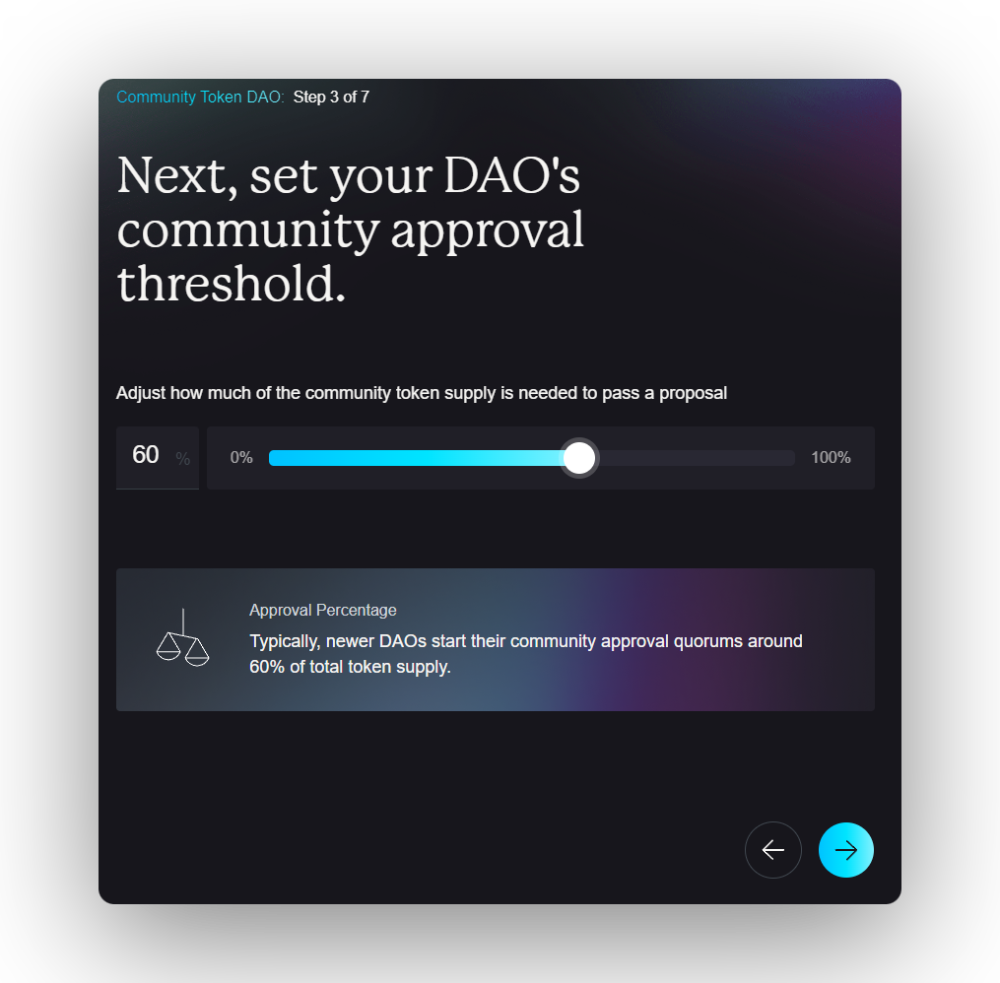

<Callout type="warning" emoji="⚠️">
Starting with a lower approval threshold can provide easier **decision-making** and **flexibility**, but may also risk power concentration and susceptibility to attacks.

The ideal threshold depends on the **DAO's** goals, community needs, and balance between efficiency, decentralisation, and security.

The specific threshold will depend on the goals and characteristics of the **DAO** and its community. It can also be adjusted over time based on feedback and experience, as the community's needs evolve.
</Callout>

### Step 6 - DAO Council

In this step you will be able to create or use an existing token for the **DAO's council**.

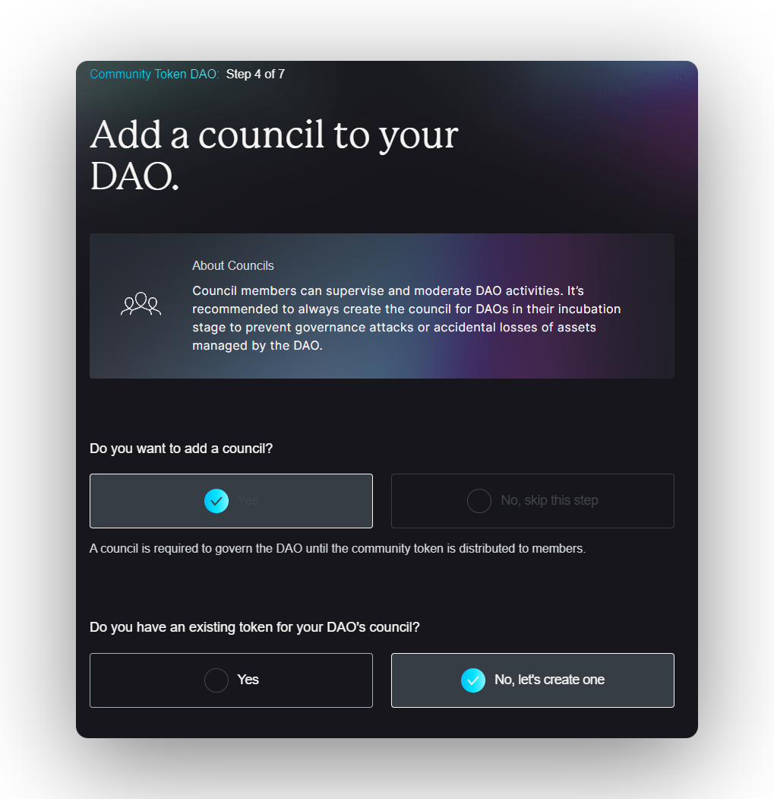

Whether to create a new token for the **DAO** council or use an existing token depends on the specific **goals**, **structure**, and **context of your DAO**. Here are some factors to consider:

* **Purpose and utility:** If the existing token already serves the **DAO's** purpose and aligns with its goals, using it for the council can streamline governance. However, if a new token can provide additional utility or better align with the **DAO's** objectives, creating a new one may be beneficial.
* **Token distribution:** If the existing token's distribution is fair and representative of the community, it may be suitable for the **DAO** council. Otherwise, a new token might be necessary to ensure broader and more balanced representation.
* **Community engagement:** Using an existing token can leverage the existing community and its interest, while a new token might attract a fresh audience and foster new engagement.
* **Economic factors:** Consider the potential impact on token value, inflation, and overall token economics when deciding between using an existing token or creating a new one.

### Step 7 - Council Members Invitiation

In this step you will be able to invite council members to the **DAO** by using their Solana wallet address.

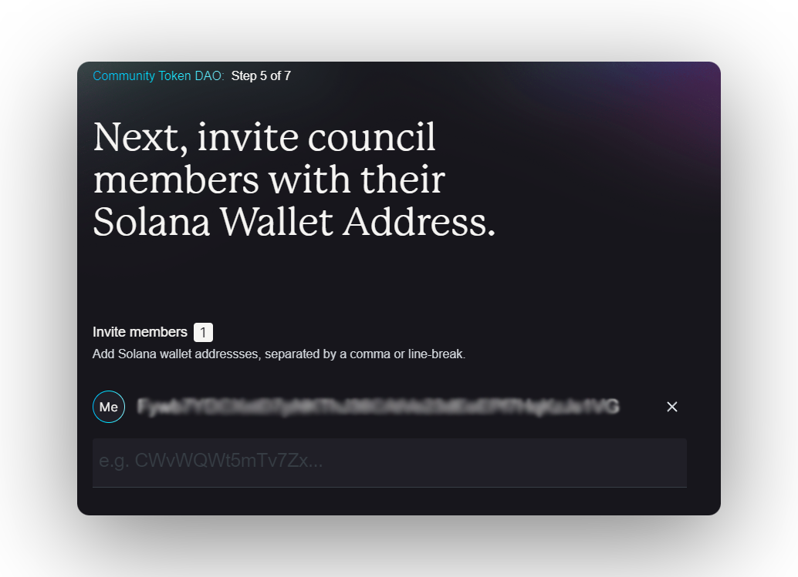

<Callout type="info" emoji="ℹ️">
Council members can supervise and moderate **DAO** activities.

It's recommended to always create the council for **DAOs** in their incubation stage to prevent **governance attacks** or **accidental losses** of assets managed by the **DAO**.
</Callout>

### Step 8 - DAO Council Approval Threshold

By setting your pre-determined **council threshold** you will be able to pass council proposals depending on how much is the **threshold percentage**.

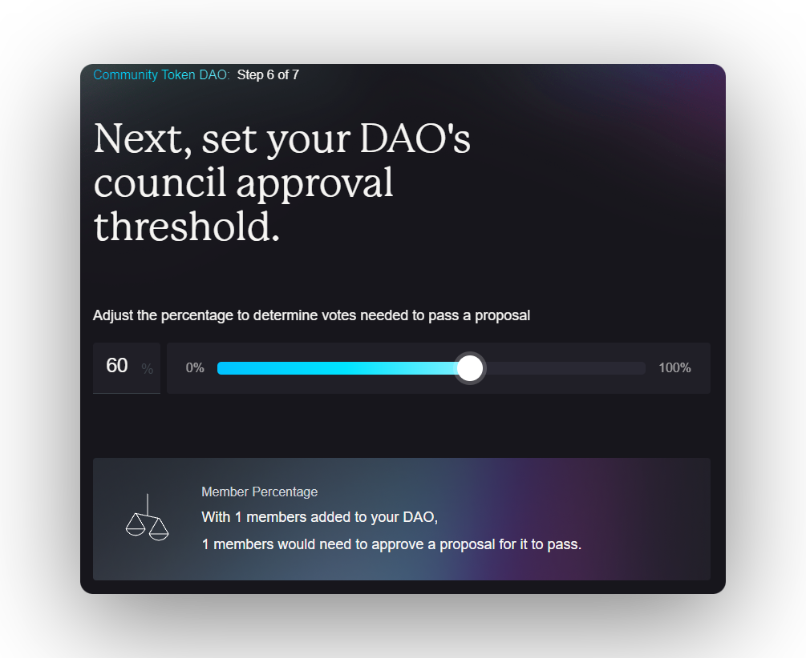

### Step 9 - Review

After following this steps, you should have something similar like the image below:

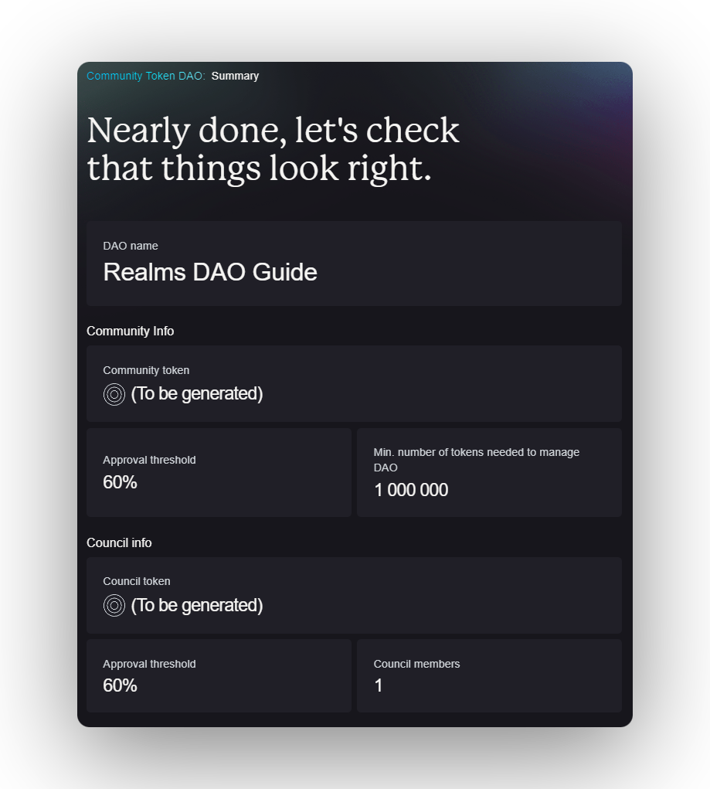
</Steps>

<Callout type="warning" emoji="⚠️">
Make sure to review all info and **double check** if everything is correct.
</Callout>

<Callout type="info" emoji="ℹ️">
After the transaction is complete, you'll be redirected to the **DAO**'s page.
</Callout>

<Callout type="default" emoji="👉">
In need of **help**? Hop on on [**Dabra Discord**](https://discord.com/invite/VsPbrK2hJk) and ask away your questions!
</Callout>