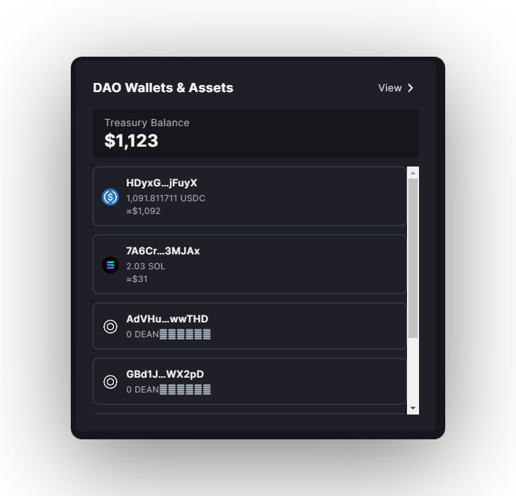
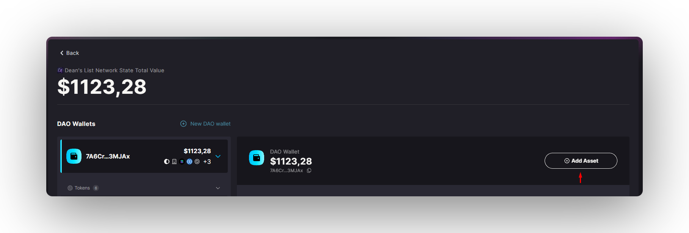
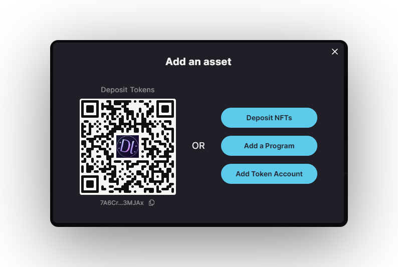
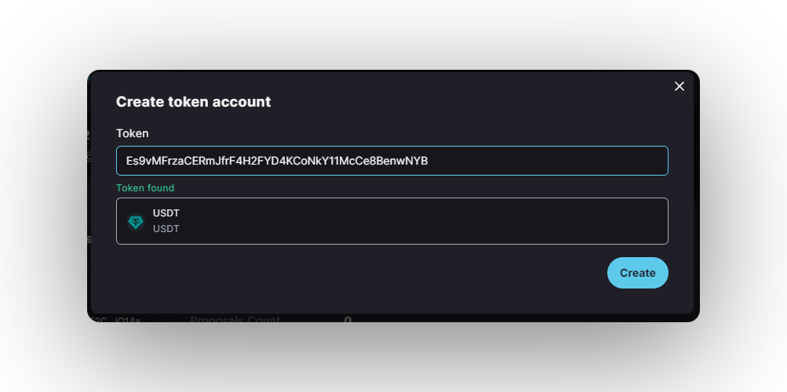
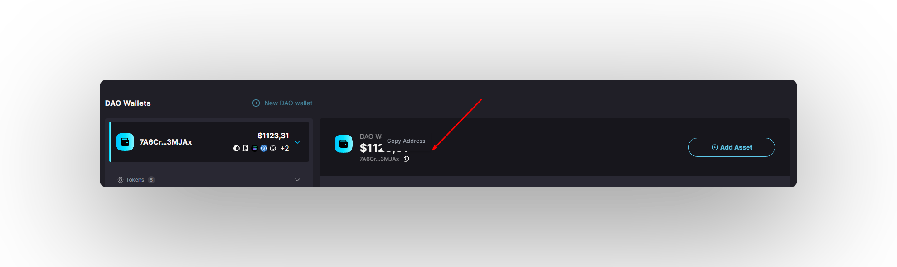
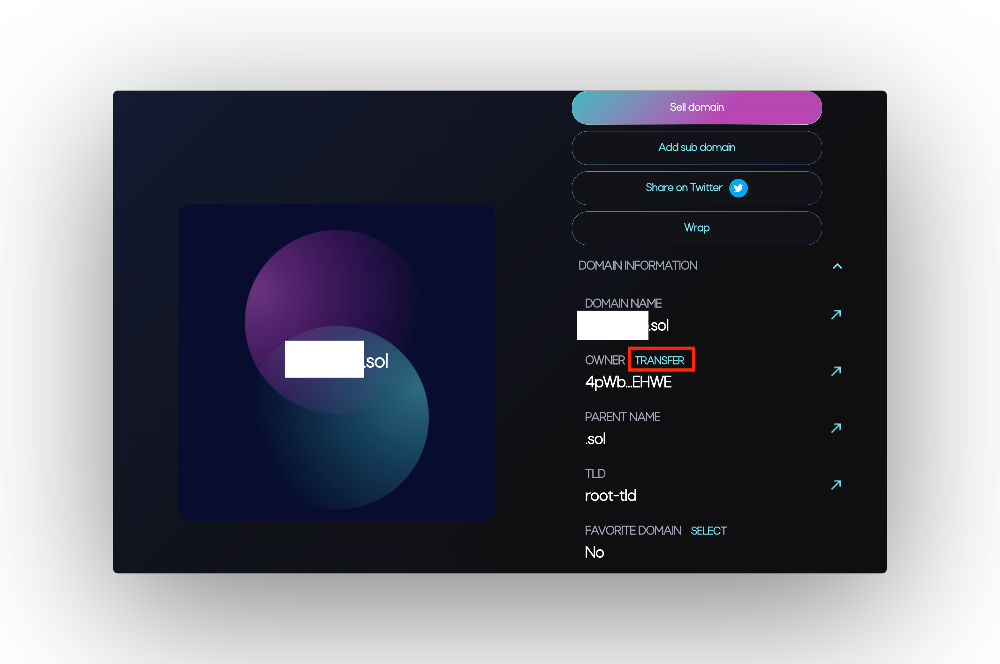

import { Callout } from 'nextra/components'
import { Steps } from 'nextra/components'

# Treasury

## Treasury Account

A **treasury account** is a shared wallet that holds assets owned by a **DAO**.

Each **DAO** can have any number of treasury accounts holding different assets (**SPL & Token22**). Anybody can deposit tokens into treasury accounts but only the **DAO** members can approve withdrawals through treasury transfer proposals​.

<Steps>
### Step 1 - Creating a Treasury Account

To create a treasury account, select the plus button in the right corner of the Treasury View​.

### Step 2 - Token Treasury

If you want your treasury account to hold tokens (e.g., **USDC**), you have to provide the token address (aka **mint address**) of the token you need​.

<Callout type="info" emoji="ℹ️">
**Common Token Addresses**:

* (SPL) **USDC:** `EPjFWdd5AufqSSqeM2qN1xzybapC8G4wEGGkZwyTDt1v`
* (SPL) **USDT:** `Es9vMFrzaCERmJfrF4H2FYD4KCoNkY11McCe8BenwNYB`
* (Token22) **ai16z:** `HeLp6NuQkmYB4pYWo2zYs22mESHXPQYzXbB8n4V98jwC`
</Callout>

<Callout type="default" emoji="👉">
**You can folow the steps below to find out the mint address of a specific token:**
    1. Go to **https://solscan.io/**
    2. Search for your token
    3. Click on the token
    4. On the URL we have the mint address: **`https://solscan.io/token/<MINT_ADDRESS>`**
</Callout>

<Callout type="info" emoji="ℹ️">
Dabra will automatically say if the token address is **correct** or **not**.
</Callout>

## Step 4 - NFT treasury

If you want your treasury account to hold NFTs, then choose the **`NFT Treasury`** option​.

</Steps>

## Settings - Treasury Governance Settings

* **Min community tokens to create a proposal**: The minimal amount of the **DAO** community governance tokens a member of the DAO has to own to be allowed to propose transfers from the treasury.&#x20;

<Callout type="info" emoji="ℹ️">
For Multisig **DAOs** without the community governance token, this value is irrelevant and it's defaulted to an arbitrary number of **`1,000,000.`**
</Callout>

* **Min instruction hold up time (days)**: The minimal number of days before you can transfer funds from the treasury after a vote on the transfer proposal is approved​.

<Callout type="info" emoji="ℹ️">
The delay for treasuries is usually set to **`0`** to allow transfers of the assets immediately after they are approved​.​
</Callout>

* **Max voting time (days)**: The maximum number of days the **DAO** can vote on the treasury proposals. If consensus is not reached by the end of the voting time, the proposal is defeated​.
* **Yes vote threshold (%)**: The Yes vote threshold defines the number of Approve votes required to approve a transfer from a treasury account. For example, if there are 10 members in the **DAO** and the Yes threshold is set to **60%**, then at least **6 members** must approve any transfers from the treasury​.

After providing all the details, press the `Create` button and the new treasury account will be created and accessible from the main page of your **DAO**​.

## Treasury Domain Name
The **Treasury domain name** is a feature in the Solana Governance UI that allows a treasury account to have a **`.sol`** address, such as **`mytreasury.sol`**, through [**Bonfida**](https://naming.bonfida.org/).

Anybody can send **`.sol`** domains to the treasury account. A **Bonfida** domain points to the current owner of said domain. For more information on solana domains, read [**Bonfida's documentation**](https://docs.bonfida.org/collection/an-introduction-to-the-solana-name-service).

<Callout type="error" emoji="🚨">
A domain name must be owned _by the **treasury**, not the **governance** itself_ to **function**.

Do not transfer **ownership** of a domain to the **governance's pubkey**.
</Callout>

<Steps>
### Step 1 - Purchasing a .sol Domain Name

To purchase a **`.sol`** domain name, you need to navigate to [**Bondifa's Solana Name Service**](https://naming.bonfida.org/) and follow the process detailed there.

### Step 2 - Setting up a Treasury Address

Before proceeding, ensure that your governance (e.g., **DAO**) has a SOL [**Treasury Accounts**]. If you don't have one set up yet, you should do so before continuing.

Once you have a treasury account, copy the **deposit address of the treasury**. This will be the address to which you'll transfer the **`.sol`** domain name

### Step 3 - Transferring the Domain to the DAO Treasury

After setting up a treasury address, the next step is to transfer your domain to the **treasury's address** (the one you just copied).

To do this, go to [**your domains**](https://naming.bonfida.org/#/profile?view=domains) on **Bonfida**, and select the domain you'd like to **transfer**. Under the "**Domain information**", "**Owner**" section, click the "**Transfer**" button. Paste in your **treasury address** and hit transfer.

Once the transaction is processed, your domain has been transferred to the **treasury** and is now pointing to your **treasury's address**. You can test this by sending a small amount of SOL to this **`.sol`** domain name and see that it arrives directly into your treasury.

<Callout type="info" emoji="ℹ️">
It is currently only possible to transfer out a domain name from the treasury to a different address using a proposal with a custom instruction.
</Callout>
</Steps>