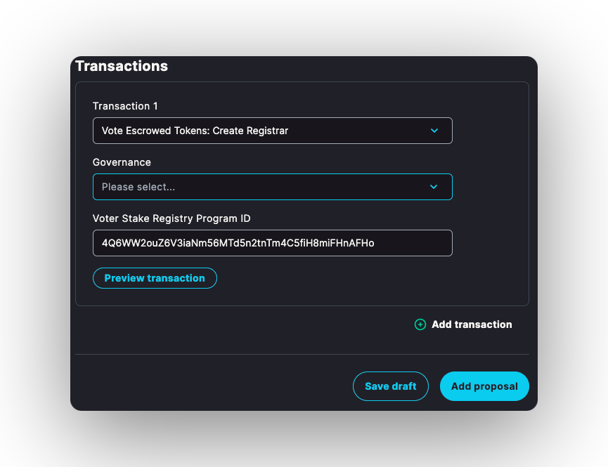
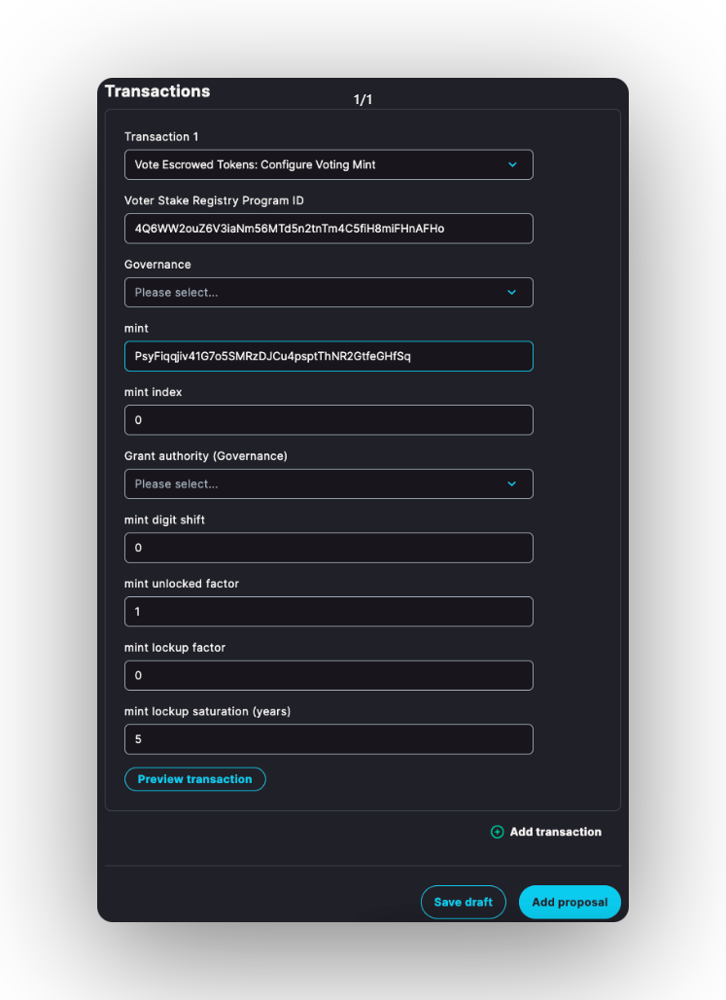
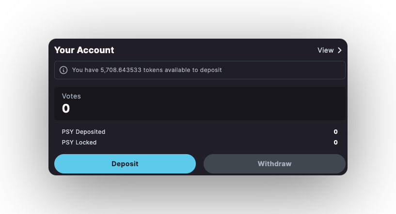
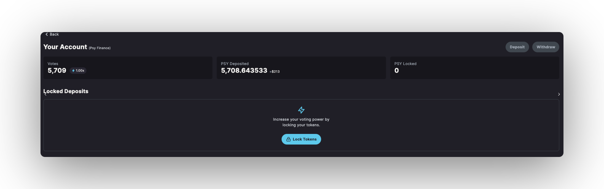
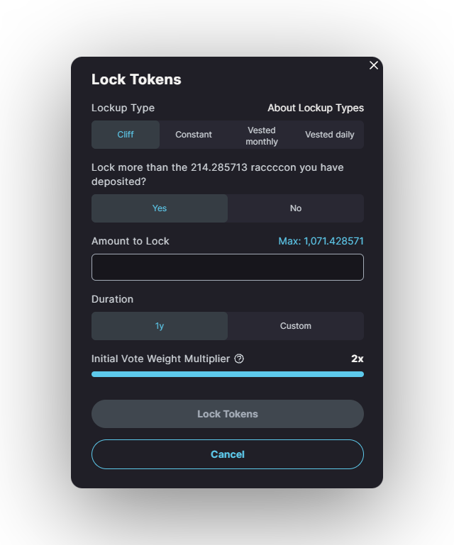
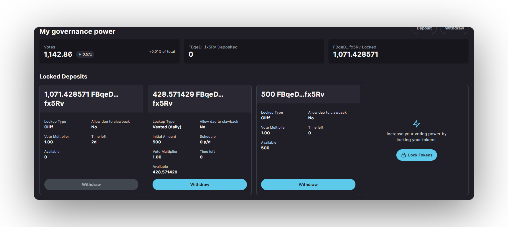
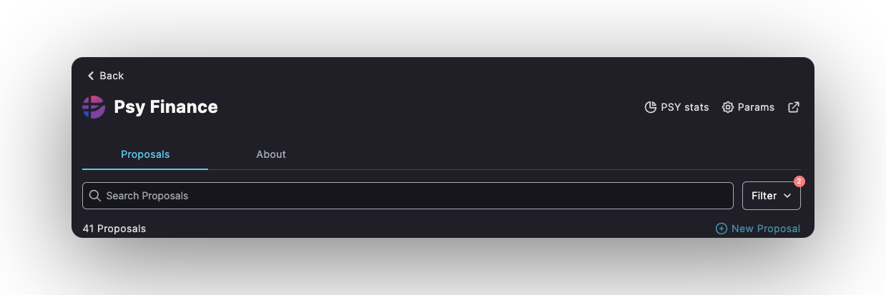
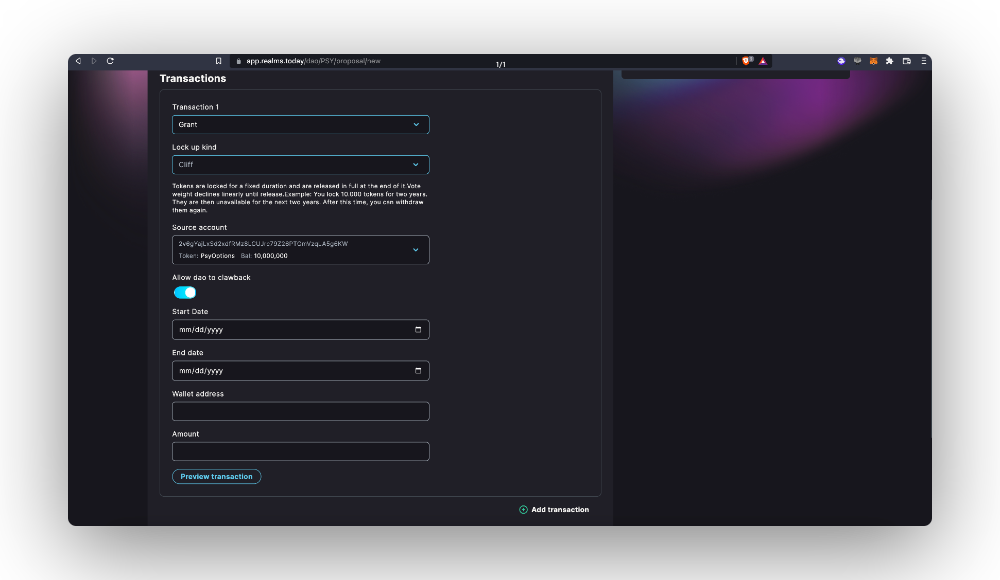
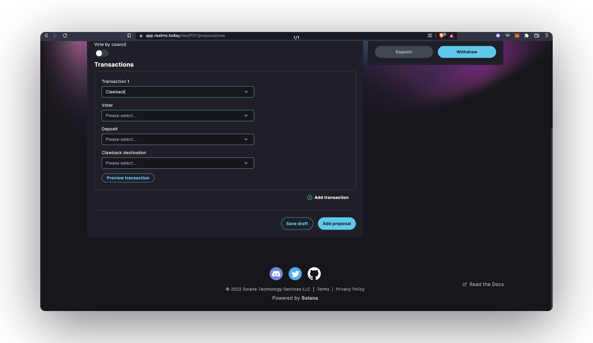

import { Callout } from 'nextra/components'
import { Steps } from 'nextra/components'

# Voter Stake Registry

## What is VSR?

VSR is a governance plugin implementing the veToken semantics. If a DAO uses the plugin (or any other plugin) then there are additional plugin instructions required to vote on a proposal.

By establishing a **Voter Stake Registry** for your **DAO** in [**Dabra**](https://dabra.app/), you can empower contributors, investors, and advisors to engage in governance while their tokens are in the vesting process. This not only fosters alignment and active participation in the **DAO**, but also ensures that every action is traceable on the chain!

## Setting up VSR for Your DAO

Deploy your own instance of the **Voter Stake Registry** to the **DAO**. Deploying your own is safest because it cannot be upgrade by some other authority, whether that authority is a person or another DAO.

<Callout type="info" emoji="ℹ️">
This step is optional, but is the safest route to go!
</Callout>

<Steps>
### Step 1 - Registrar

Create a Registrar by passing in the governance program ID, and the community token mint. Registrars are uniquely constrained (via PDA usage) by those two parameters.

<Callout type="info" emoji="ℹ️">
Using the SPL Governance UI today will default to the community owned VSR instance.
</Callout>

Use **`ConfigureVotingMint`** to add a token to the Registrar and set it's vote weight. This instruction is where a lot of magic happens and _**needs to be carefully paid attention to!**_

<Callout type="info" emoji="ℹ️">
**Consider this -** Should the vote weight be relative to the community token that is tied to the Registrar?
</Callout>

<Callout type="warning" emoji="⚠️">
Remaining accounts must be all the token mints that have registered as voting mints, _**including the newly registered one.**_
</Callout>

### Step 2 -  ConfigureVotingMint Parameters

* **idx:** index of the rate to be set. There is an array of `VotingMintConfig`s, and the idx references the index that the corresponding config is or should be placed. When adding a new one it should be the next index.
* **digit\_shift:** the amount of digits to shift the native token amount. If set to positive number, the base is shifted to left. E.g. if set to then 100 tokens will give 1000 voting power. If set to -1 then 100 voting power will become 10.
* **baseline\_vote\_weight\_scaled\_factor:** this simply means how much voting power will the user receive for simply depositing the tokens. Let's say, if set at 1. The user will receive 1 vote for every token deposited. If you don't wanna give voting power to users for simply depositing the tokens, you can set it to 0. Vote weight factor for all funds in vault, in 1/1e9 units. So 1e9 means 1!
* **max\_extra\_lockup\_vote\_weight\_scaled\_factor:** this is the max voting power a user will receive for locking the tokens. Let' say, if set to 2, a user will receive 2x the deposited tokens if they lock it for the max duration. Max extra weight for lockups, in 1/1e9 units. So 1e9 means no matter how long a lock up period is the voting weight can never exceed this factor.
* **lockup\_saturation\_secs:** this is the duration for which the user has to keep the tokens locked to receive the voting power. A user can lock tokens for lesser period and will receive proportionate tokens. This is a factor that dampens the lock up vote power boost until this has passed. If this max boost power is 1e9 (factoring in the scale factor it's 1), then this value does not matter.
* **grant\_authority:** The authority that can grant the additional vote weight. This should be a governance authority.

<Callout type="info" emoji="ℹ️">
**voting\_power** = baseline\_vote\_weight + min(lockup\_time\_remaining / lockup\_saturation\_secs, 1) \* max\_extra\_lockup\_vote\_weight
</Callout>

### Step 3 -  Dabra Config

Enable the voter weight plugin by calling the **`SetDabraConfig`** instruction on the SPL Governance program used or use the Dabra UI to setup the change it for you.

**Option 1**:

<Callout type="info" emoji="ℹ️">
Use the Dabra Config proposal, and put the voter stake registry program ID as the community vote plugin.
</Callout>

**Option 2**:

Go to your DAO page, then `Params` → `Config` → `Change Config` → `What type of governance structure do you want your DAO's community to use?` → `VSR`

After doing these steps press continue and fill out the title and description for your DAO to know about the change.

</Steps>

## How to Lock Your Own Tokens

Brief guide onto how to lock your tokens after **VSR** is enable for the **DAO** in case.

<Steps>
### Step 1 - Deposit

Go to view your account on [**Dabra**](https://dabra.app/).

Deposit your tokens.

Click "**View**" in the right hand corner of the "**Your Account**" section of the page. (See the image under step 1.)

To lock your tokens, click "**Lock Tokens**".

### Step 2 - Lockup Type Selection

Select the "**Lockup Type**", the amount of tokens to lock, and the duration of the lockup.

There are three lockup types: "**Cliff**", "**Constant**" and "**Vested**".
    - **Cliff** - The cliff lockup sets a date in the future and your lockup tokens and governance power will be decaying when approaching that fixed date and you will get back your tokens that you deposited back then.
    - **Constant** - With constant lockup your lockup your tokens basically and hence voting power never decays, if you set it to 2 years now it's going to be still 2 years a year from now, in other words there is no fixed end date of the lockup.
    - **Vested** - With vested lockup type you are able to choose between monthly and daily where you will get to claim your tokens daily/monthly while your governance power decays.

<Callout type="info" emoji="ℹ️">
You may have heard the term "**Cliff**" before when discussing investor, or team token lockup schedules.
</Callout>

### Step 3 - Lock

After setting your lockup schedule, and clicking "**Lock Tokens**" you will now be able to see information regarding your lockups from the Account page.

</Steps>

## How to Propose Issuing Locked Tokens

Brief guide onto how to propose issuing locked tokens after **VSR** is enable for the **DAO** in case.

<Steps>
### Step 1 - Create Proposal

Head to your **DAO** page on [**Dabra**](https://dabra.app/).

Select "**New Proposal**".

Input a Title and Description for your proposal.

### Step 2 - Transaction Type

Select the Transaction type. In this case, you will select **Grant.**&#x20;

Select the "**Lock up kind**".

Fill out the rest of the relevant information such as the **start date**, **end date**, **wallet address** and the **amount**.

### Step 3 - Create the Proposal

<Callout type="warning" emoji="⚠️">
If the proposal is **passed**, the recipient must **execute the transaction**!
</Callout>
</Steps>

## How to Propose Clawing Back Granted Tokens

Brief guide onto how to propose clawing back granted tokens after **VSR** is enable for the **DAO** in case.

### Step 1 - Create Proposal

Head to your **DAO** page on [**Dabra**](https://dabra.app/).

Select "**New Proposal**".

Input a Title and Description for your proposal.

### Step 2 - Transaction Type

Select the Transaction type. In this case, you will select **Clawback.**

- Fill out the clawback information.
    - **Voter:** The Solana wallet address that received the Grant.
    - **Deposit:** A single voter could receive multiple Grants. Selecting this determines which Grant the proposal would clawback.
    - **Clawback Destination:** The Treasury Account the clawed back tokens should go into.

### Step 3 - Create the Proposal

<Callout type="info" emoji="ℹ️">
If you try to **clawback** tokens that have voted on an active proposal the tokens will be transferred back to the treasury, the vote will stay, but the user will no longer have the voting power.
</Callout>

<Callout type="default" emoji="👉">
In need of **help**? Hop on on [**Dabra Discord**](https://discord.com/invite/VsPbrK2hJk) and ask away your questions!
</Callout>