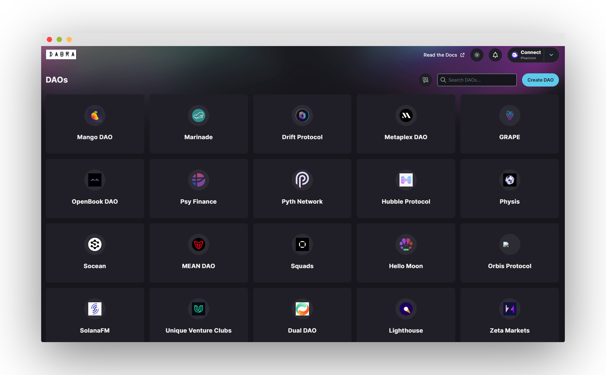
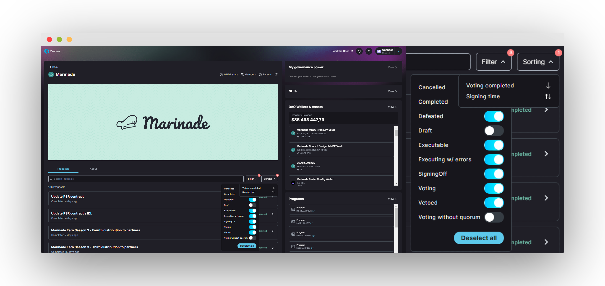
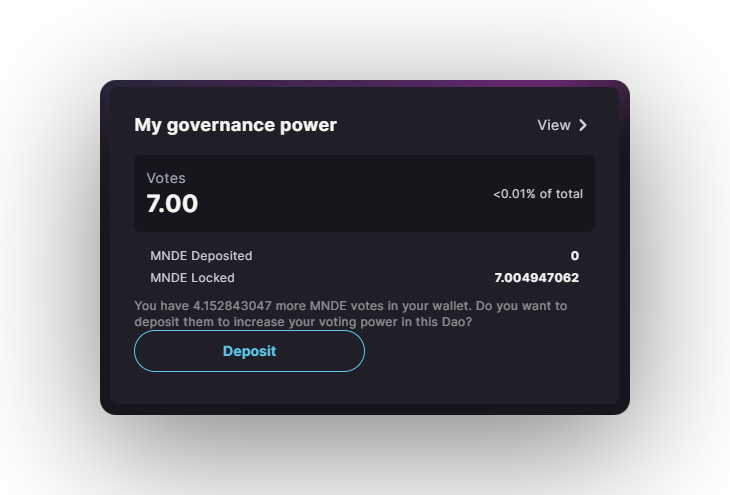
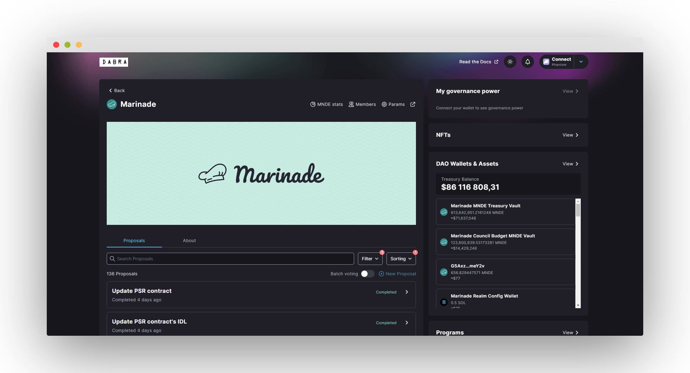

import { Callout } from 'nextra/components'

# DAOs

At its simplest, a **decentralized autonomous organization** (**DAO**) is a community with a shared bank account. Members of the **DAO** make decisions in a **transparent** and **decentralized** fashion, with smart contracts executing these decisions.

For instance, a member can create a proposal suggesting an investment of the treasury or a program upgrade. The **DAO** members then come together to vote on the proposal. If a predefined quorum votes for the proposal to pass, the proposal is accepted and and executed by a smart contract.

As a result, the **DAO** structure provides a "flat" organizational structure. Each **DAO** member has a voice in the community and the opportunity to drive the direction of the organization.

## Where to find them?

DAOs are displayed upon visiting Dabra and can primarily be filtered by the search bar and searching for the DAO you wish to visit.

You can access a DAO directly via a link that includes domain name (e.g., https://app.dabra.app/dao/MNDE). Custom domain names for spaces are also supported (bonkedao.com, dao.dabra.app/Deanslist).

## Proposal Filtering & Sorting

Users can go through all of DAO proposals and turn on/off specific filters to them, including completed, canceled, and defeated proposals.

## Joining a DAO

Users can join a DAO by simply hitting the `Deposit` button.

## DAO Landing Page

Users when landing in their preferred DAO page will able to see straight away:

- Token Stats
- Members
- Params (DAO Config)
- DAO Owned NFTs
- DAO Wallets & Assets (Treasury)
- Programs (Programs that involve dApp /\ Dabra interactions)
- Proposals

Users who have their Solana wallet connected will be able to see their governance power where they can `Deposit`, `Withdraw`, `Delegate` & `Lock Tokens`.

<Callout type="info" emoji="ℹ️">
Token Stats are only available for DAOs with VSR (Voter Stake Registry) enabled.
</Callout>

